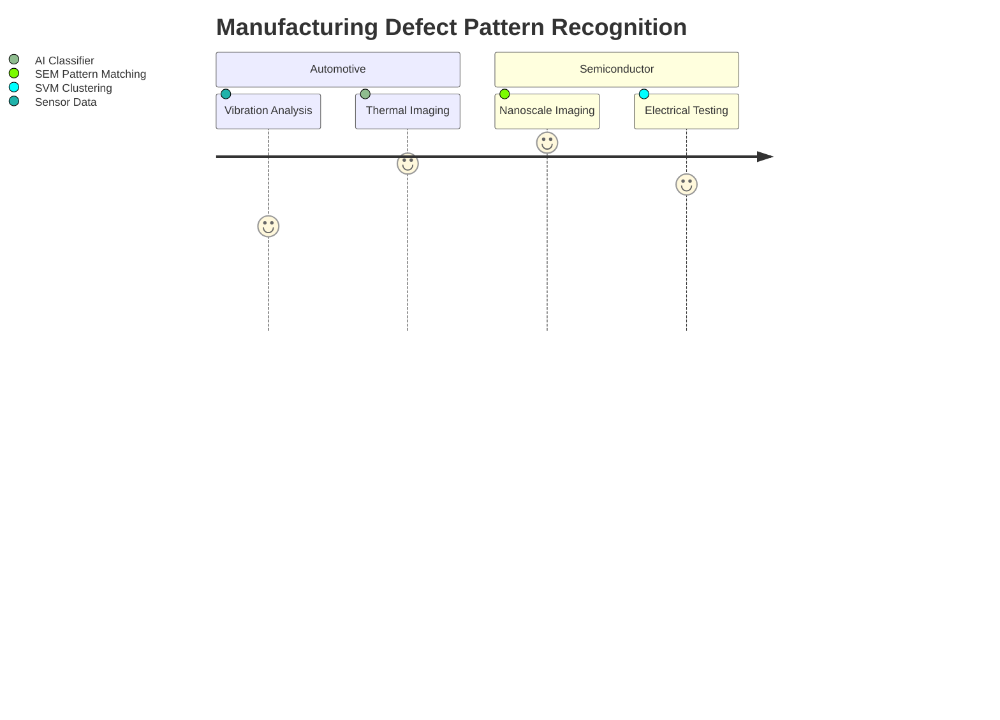
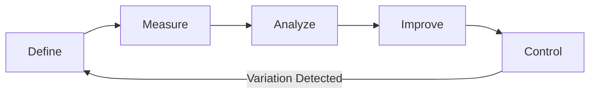
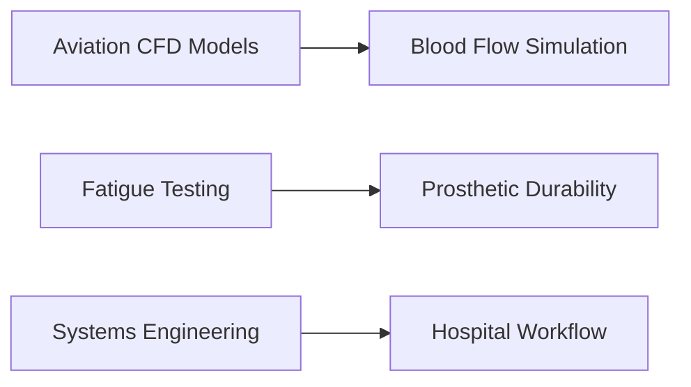

# Assessment and Mastery

This document consolidates the framework for assessing problem-solving skills and the guide for achieving mastery, combining the Problem-Solving Rubric and the Comprehensive Problem-Solving Mastery Guide.

## Problem-Solving Rubric

This rubric provides detailed competency levels for key problem-solving skills.

### Category: Identifying the Problem

**Level 4: Exceeds Expectations**
- Demonstrates the ability to identify complex problems accurately and thoroughly, considering multiple perspectives and underlying causes.
- Actively seeks out relevant information from various sources to fully understand the problem (e.g., conducts thorough research, consults with experts, analyzes data).
- Displays a deep level of critical thinking and analysis in defining the problem, clearly articulating the core issues and their potential impact.

**Level 3: Meets Expectations**
- Identifies problems effectively and efficiently.
- Clarifies the problem by asking probing questions and gathering necessary data.
- Shows basic critical thinking skills in defining the problem.

**Level 2: Needs Improvement**
- Struggles to accurately identify the problem or may oversimplify it.
- Fails to gather sufficient information to fully understand the problem.
- Lacks critical thinking skills in defining the problem.

**Level 1: Unsatisfactory**
- Inability to identify the problem or misidentifies it.
- Does not seek out relevant information or misinterprets data.
- Lacks basic critical thinking skills.

### Category: Analyzing the Problem

**Level 4: Exceeds Expectations**
- Demonstrates a high level of critical thinking and analysis in breaking down the problem into manageable parts, identifying key components and their relationships.
- Applies appropriate tools and techniques to analyze the problem (e.g., SWOT analysis, fishbone diagrams, data analysis).
- Considers the impact of the problem on various stakeholders, understanding their perspectives and potential concerns.

**Level 3: Meets Expectations**
- Analyzes the problem in a systematic and logical manner.
- Uses appropriate tools and techniques to break down the problem.
- Considers the implications of the problem for relevant parties.

**Level 2: Needs Improvement**
- Struggles to analyze the problem effectively.
- Fails to use appropriate tools and techniques to break down the problem.
- Overlooks the impact of the problem on stakeholders.

**Level 1: Unsatisfactory**
- Unable to analyze the problem.
- Does not use appropriate tools or techniques.
- Ignores the impact of the problem on stakeholders.

### Category: Generating Solutions

**Level 4: Exceeds Expectations**
- Demonstrates creativity and innovation in generating multiple, high-quality solutions that are both original and effective.
- Considers the feasibility, effectiveness, and potential consequences (both positive and negative) of each solution, conducting thorough risk assessments.
- Seeks input and feedback from others to enhance the solution set, fostering collaboration and diverse perspectives.

**Level 3: Meets Expectations**
- Generates a sufficient number of reasonable solutions.
- Evaluates each solution for feasibility and effectiveness.
- Considers potential consequences of each solution.

**Level 2: Needs Improvement**
- Struggles to generate diverse and high-quality solutions.
- Fails to thoroughly evaluate the feasibility and effectiveness of solutions.
- Overlooks potential consequences of solutions.

**Level 1: Unsatisfactory**
- Unable to generate solutions or generates only poor-quality solutions.
- Does not evaluate solutions for feasibility or effectiveness.
- Ignores potential consequences of solutions.

### Category: Selecting the Best Solution

**Level 4: Exceeds Expectations**
- Demonstrates excellent judgment in selecting the most effective and feasible solution, providing a well-reasoned justification for the choice.
- Considers the input and feedback of others in the decision-making process, demonstrating strong collaborative skills.
- Develops a clear and actionable plan for implementing the solution, including timelines, resources, and responsibilities.

**Level 3: Meets Expectations**
- Selects a suitable solution based on a thorough evaluation of options.
- Takes stakeholder input into account when making a decision.
- Creates a reasonable plan for implementing the solution.

**Level 2: Needs Improvement**
- Struggles to choose the best solution or makes a poor choice.
- Ignores input from relevant parties.
- Develops an inadequate plan for implementation.

**Level 1: Unsatisfactory**
- Unable to select a solution or makes a clearly incorrect choice.
- Disregards input from others.
- Fails to create a plan for implementation.

### Category: Implementing the Solution

**Level 4: Exceeds Expectations**
- Demonstrates exceptional project management skills in executing the solution, managing resources effectively and efficiently.
- Adapts the solution as necessary to address unforeseen challenges, demonstrating flexibility and problem-solving skills during implementation.
- Monitors progress and adjusts implementation strategies accordingly, ensuring the project stays on track and achieves desired outcomes.

**Level 3: Meets Expectations**
- Effectively implements the solution, addressing challenges as they arise.
- Makes minor adjustments to the solution as needed.
- Tracks progress and modifies strategies as appropriate.
- Modifies implementation strategies appropriately to maintain momentum and address minor deviations.

**Level 2: Needs Improvement**
- Struggles to implement the solution or encounters significant challenges.
- Makes major errors in execution.
- Fails to track progress or modify strategies.
- Demonstrates limited adaptability and struggles to adjust implementation strategies in response to challenges.
- Requires more than usual guidance and support to keep implementation efforts moving forward.

**Level 1: Unsatisfactory**
- Unable to implement the solution or executes it poorly.
- Ignores challenges and makes critical errors.
- Does not track progress or modify strategies.
- Shows no adaptability and fails to adjust strategies even when faced with obvious obstacles.
- Requires constant guidance and intervention and is often unable to proceed independently.

### Category: Evaluating the Solution

**Level 4: Exceeds Expectations**
- Demonstrates a high level of critical thinking and analysis in evaluating the success of the solution against predefined criteria and objectives.
- Considers the long-term impact of the solution, assessing its sustainability and potential future implications.
- Applies lessons learned to future problem-solving efforts, contributing to organizational learning and improvement.
- Provides insightful and forward-thinking evaluation reports that drive strategic decision-making and continuous improvement.

**Level 3: Meets Expectations**
- Evaluates the success of the solution in a thorough and systematic manner.
- Considers the short-term impact and effectiveness of solutions in meeting immediate objectives.
- Demonstrates basic consideration of solution sustainability and longer-term implications.
- Applies new knowledge gained from evaluation to improve future problem-solving approaches.
- Provides clear and well-supported evaluations of solution success and areas for improvement.

**Level 2: Needs Improvement**
- Conducts basic evaluations but may lack thoroughness or rigor in the assessment process.
- Overlooks long-term impacts and primarily focuses on immediate outcomes.
- Demonstrates limited consideration of solution sustainability or broader implications.
- Struggles to apply new knowledge gained from evaluations to improve future problem-solving.
- Evaluations may be superficial, lacking depth, or insufficiently supported by evidence.

**Level 1: Unsatisfactory**
- Unable to evaluate solutions effectively and conducts poor or superficial evaluations, if at all.
- Completely ignores long-term impacts, sustainability, or broader implications of solutions.
- Demonstrates no application of new knowledge or lessons learned from past evaluations.
- Evaluations are absent, illogical, or based on flawed assumptions and misinterpretations.
- Shows an overall inability to assess solution effectiveness or identify areas for improvement.

## Comprehensive Problem-Solving Mastery Guide

This guide outlines a structured approach and key components for achieving mastery in problem-solving.

### 1. Structural Problem Decomposition Framework
#### 1.1 Multidimensional Analysis Matrix
```mermaid
graph TD
    A[Complex Problem] --> B{Scope Definition}
    B -->|Boundary Conditions| C[((Constraint Mapping))]
    B -->|Stakeholder Analysis| D[Interest/Power Grid]
    C --> E[Subsystem Identification]
    D --> E
    E --> F[Dependency Network Model]
    F --> G[Work Package Prioritization]
```

#### 1.2 Decomposition Validation Protocol
1.  **Boundary Verification**
    - Confirm problem scope with [domain-specific regulatory framework]
    - Validate constraints against [organizational capability matrix]

2.  **Stakeholder Calibration**
    ```python
    def calculate_stakeholder_priority(influence, interest):
        return (0.6 * normalize(influence)
               + 0.4 * normalize(interest))
    ```

3.  **Dependency Analysis**
    - Identify critical path components using [PERT/CPM methodology]
    - Map cross-system interactions through [N² diagramming]

### 2. Cognitive Pattern Recognition System
#### 2.1 Multilayer Recognition Architecture
| Layer | Function         | Analytical Technique        |
|-------|------------------|-----------------------------|
| 1     | Signal Detection | Wavelet Transform Filtering |
| 2     | Feature Extraction | Principal Component Analysis|
| 3     | Pattern Matching | Dynamic Time Warping        |
| 4     | Contextual Validation| Bayesian Belief Networks    |

#### 2.2 Industrial Case Matrix


### 3. Hypothesis Generation Engine
#### 3.1 TRIZ-Based Ideation Framework
```math
InnovationIndex = \frac{\sum_{i=1}^{n} (Novelty_i \times Feasibility_i)}{ResourceComplexity}
```

**Solution Generation Protocol:**
1. Contradiction Matrix Analysis
2. 40 Inventive Principles Application
3. Substance-Field Modeling
4. Evolutionary Pattern Forecasting

#### 3.2 Pharmaceutical Development Example
```python
class DrugDiscoveryHypothesis:
    def __init__(self, target_protein, mechanism):
        self.binding_affinity = calculate_docking_score(target_protein)
        self.toxicity_profile = predict_admet_properties(mechanism)
        self.synthesis_path = retrosynthetic_analysis(mechanism)

    def viability_score(self):
        return (0.5 * self.binding_affinity
               + 0.3 * (1 - self.toxicity_profile)
               + 0.2 * self.synthesis_path.efficiency)
```

### 4. Multi-Criteria Decision Analysis
#### 4.1 AHP-TOPSIS Hybrid Model
```math
\text{Normalized Decision Matrix } R = [r_{ij}]_{m×n} \text{ where } r_{ij} = \frac{x_{ij}}{\sqrt{\sum_{i=1}^{m} x_{ij}^2}}
```

**Implementation Steps:**
1. Pairwise Comparison Matrix Construction
2. Consistency Ratio Validation (CR < 0.1)
3. Weighted Normalized Matrix Calculation
4. Ideal/Negative Ideal Solution Identification
5. Relative Closeness Coefficient Computation

#### 4.2 Energy Sector Case Study
```mermaid
gantt
    title Renewable Energy Project Selection
    dateFormat  YYYY-MM
    section Criteria Weights
    Capital Cost       :30%
    Operational Risk  :25%
    CO2 Reduction     :20%
    Social Impact     :15%
    Tech Readiness    :10%

    section Alternatives
    Offshore Wind     :crit, alt1, 2025-01, 2026-12
    Solar Farm        :alt2, 2025-03, 2027-06
    Geothermal        :alt3, 2025-06, 2028-03
```

### 5. Adaptive Refinement Cycle
#### 5.1 Six Sigma Integration


**Statistical Control Metrics:**
- Process Capability Index (Cpk)
- Cumulative Sum Control Chart (CUSUM)
- Exponentially Weighted Moving Average (EWMA)

## 6. Organizational Learning Architecture
### 6.1 Knowledge Graph Implementation
```json
{
  "node_types": [
    {"name": "FailureMode", "properties": ["root_cause", "detection_method"]},
    {"name": "Solution", "properties": ["effectiveness", "implementation_cost"]},
    {"name": "Expert", "properties": ["domain", "success_rate"]}
  ],
  "relationship_types": [
    {"name": "ADDRESSES", "source": "Solution", "target": "FailureMode"},
    {"name": "VALIDATED_BY", "source": "Solution", "target": "Expert"}
  ]
}
```

## 7. Cross-Domain Transfer System
### 7.1 Analogical Reasoning Framework
```python
def transfer_solution(source_domain, target_domain):
    base_pattern = extract_core_mechanism(source_domain)
    adapted_solution = apply_constraint_mapping(base_pattern,
                                               target_domain.requirements)
    validation_metrics = run_simulation(adapted_solution)
    return optimize_parameters(adapted_solution, validation_metrics)
```

### 7.2 Aerospace → Healthcare Transfer


## 8. Mastery Certification Protocol
### 8.1 Competency Assessment Matrix
| Dimension   | Evaluation Method      | Benchmark             |
|-------------|------------------------|-----------------------|
| Technical   | Monte Carlo Simulation | 95% Confidence Interval|
| Strategic   | War Game Simulation    | Nash Equilibrium      |
| Operational | Digital Twin Validation| <5% Variance       |

### 8.2 Continuous Professional Development
```math
CPD_{score} = \sum_{q=1}^{4} \left(0.4T_q + 0.3I_q + 0.2M_q + 0.1L_q\right)
```
Where:
- T = Technical Training
- I = Implementation Projects
- M = Mentorship
- L = Leadership

## Implementation Toolkit
1.  **Digital Companion Platform**
    - Integrated with [Enterprise Knowledge Graph]
    - Real-time collaboration through [Distributed Ledger]

2.  **Adaptive Learning Interface**
    - Personalized curriculum based on [Competency Gap Analysis]
    - AR/VR simulation environment

3.  **Decision Support System**
    - Hybrid AI combining [Symbolic Reasoning] + [Neural Networks]
    - Automated impact forecasting through [System Dynamics]