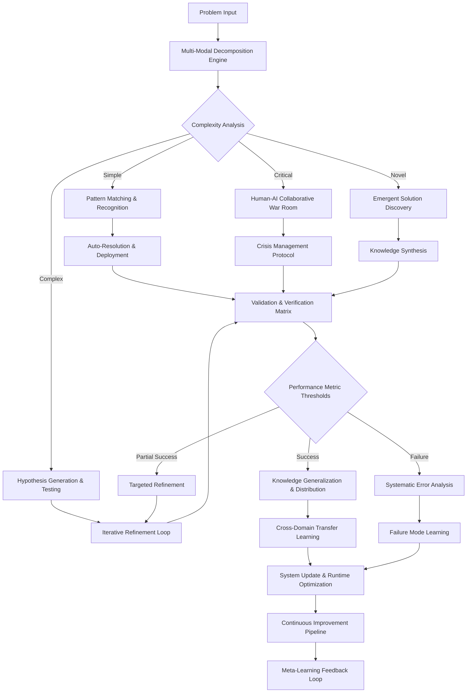
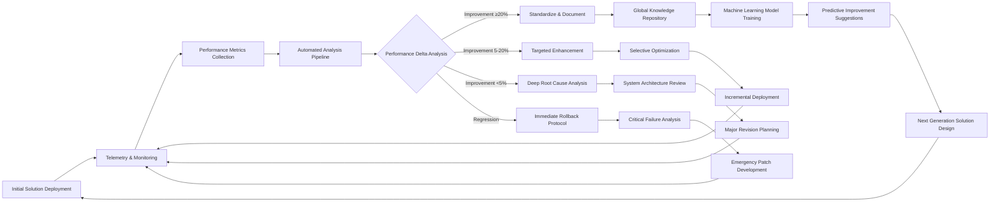

# Problem-Solving Conveyor System Methodology

This document outlines the Problem-Solving Conveyor System, detailing its architecture, protocols, and mechanisms for adaptive and enhanced problem-solving, incorporating elements from both the base and enhanced versions.

## Adaptive Cognitive Framework Architecture



## Hyper-Dimensional Problem Decomposition

### Advanced Structural Breakdown Protocol
1.  **Hierarchical Component Identification**
    - Advanced NLP entity extraction with domain-specific taxonomies
    - Multi-level dependency graph construction with weighted connections
    - Temporal relationship mapping (preconditions, concurrency requirements)
    - Constraint identification and categorization (technical, resource, regulatory)

    *(From base version: NLP entity extraction, Dependency graph construction)*

2.  **Dynamic Complexity Scoring Algorithm**
    ```python
    def calculate_complexity(component, context):
        base_score = (
            0.30 * len(component.dependencies) +
            0.20 * component.unknown_factors +
            0.15 * historical_failure_rate(component) +
            0.15 * novelty_coefficient(component, context) +
            0.10 * stakeholder_impact(component) +
            0.10 * integration_complexity(component, system_architecture)
        )

        # Apply environmental modifiers
        time_pressure_modifier = 1 + (0.5 * urgency_factor)
        organizational_readiness = calculate_readiness_score(component.domain)

        return base_score * time_pressure_modifier / organizational_readiness
    ```
    *(From base version: A simpler complexity calculation function)*

3.  **Adaptive Work Package Creation & Assignment**
    | Sub-Problem                | Owner            | Expertise Required         | Time Budget   | Resource Allocation          | Success Criteria                               | Failure Mitigation             |
    | -------------------------- | ---------------- | -------------------------- | ------------- | ---------------------------- | ---------------------------------------------- | ------------------------------ |
    | API Performance Bottleneck | AI System + DevOps | Distributed Systems        | 45min         | 4 compute nodes              | 99.95% uptime, <50ms latency                 | Auto-scaling fallback          |
    | Authentication Flow        | Security Team    | Zero-trust architecture    | 3hr           | 2 engineers                  | OWASP compliance, <3sec auth time            | Circuit breaker pattern        |
    | Data Consistency           | Database Cluster | ACID transactions          | 90min         | DB optimization suite        | 100% integrity, <5% overhead                 | Read-replica degradation       |
    | UX Navigation Flow         | Human-AI Team    | Cognitive ergonomics       | 2hr           | Prototype framework          | 95% completion rate, 90% user satisfaction     | A/B test alternative           |

    *(From base version: A simpler work package table)*

### Cross-Functional Integration Mapping
*   **Dependency Resolution Graph**
    - Critical path identification with resource optimization
    - Parallelization opportunity detection
    - Bottleneck prediction and preemptive resolution

*   **Stakeholder Impact Matrix**
    ```markdown
    | Stakeholder Group    | Component Involvement    | Priority Weighting   | Communication Protocol          |
    |----------------------|--------------------------|----------------------|---------------------------------|
    | Executive Leadership | Strategic Alignment      | 0.9                  | Weekly Digest, Exception Alerts |
    | Technical Teams      | Implementation Details   | 0.8                  | Daily Scrums, Real-time Dashboards |
    | End Users            | UX Components            | 0.95                 | Beta Testing, Satisfaction Surveys |
    | Regulatory Bodies    | Compliance Elements      | 0.99                 | Formal Documentation, Audit Trail |
    ```

## Quantum-Inspired Pattern Recognition System

### Multi-dimensional Detection Matrix
| Pattern Taxonomy            | Detection Mechanism                                     | Confidence Threshold   | Resolution Pathway                               | Automation Potential             |
| --------------------------- | ------------------------------------------------------- | ---------------------- | ------------------------------------------------ | -------------------------------- |
| Cyclic Inefficiencies       | Spectral Fourier Analysis + Time Series Decomposition   | 85%                    | Algorithmic Loop Optimization, Caching Strategies | Full Automation                  |
| Sequential Process Failures | Advanced Markov Chain + Decision Tree Hybrid            | 80%                    | Process Reengineering, Exception Handling        | Semi-Automated with Human Verification |
| Spatial Resource Conflicts  | CNN + Graph Neural Network Clustering                   | 90%                    | Dynamic Resource Reallocation, Contention Management | Context-Dependent Automation     |
| Emergent System Behaviors   | Complex Adaptive Systems Analysis                       | 75%                    | System Architecture Refinement, Chaos Engineering | Human-Guided Machine Learning    |
| Temporal Degradation        | Longitudinal Data Analysis + Regression                 | 82%                    | Preventative Maintenance, Technical Debt Reduction | Scheduled Automation             |

*(From base version: A simpler detection matrix)*

### Pattern Library Expansion Protocol
1.  **Pattern Extraction Pipeline**
    - Continuous monitoring of solved problems
    - Feature vectorization of solution characteristics
    - Unsupervised clustering of similar solutions
    - Automatic abstraction of solution templates

2.  **Self-Evolving Pattern Database**
    ```python
    class PatternLibrary:
        def __init__(self):
            self.patterns = []
            self.effectiveness_metrics = {}
            self.cross_domain_applicability = {}

        def add_pattern(self, new_pattern):
            similarity_scores = [cosine_similarity(new_pattern, p) for p in self.patterns]
            if max(similarity_scores, default=0) < 0.85:  # Truly new pattern
                self.patterns.append(new_pattern)
            else:  # Enhance existing pattern
                self.merge_patterns(new_pattern, self.patterns[argmax(similarity_scores)])

        def retrieve_applicable_patterns(self, problem_vector, top_k=5):
            relevance_scores = [pattern.match_score(problem_vector) for pattern in self.patterns]
            return sorted(zip(self.patterns, relevance_scores), key=lambda x: x[1], reverse=True)[:top_k]

        def update_effectiveness(self, pattern_id, success_metrics):
            # Bayesian update of effectiveness based on application results
            self.effectiveness_metrics[pattern_id] = bayesian_update(
                self.effectiveness_metrics.get(pattern_id, (0, 0)),
                success_metrics
            )
    ```

## Advanced Hypothesis Management System

### Multi-stage Generation Protocol
1.  **Divergent Thinking Phase (AI-Orchestrated)**
    - Constraint-free brainstorming with quantum-inspired search
    - Cross-domain analogy mining using knowledge graphs
    - Counterfactual reasoning and assumption inversion
    - Biomimicry and natural systems inspiration
    - Historical solution pattern adaptation
    *(From base version: Divergent Thinking Phase (AI) - Constraint-free brainstorming, Cross-domain analogy mining)*

2.  **Convergent Filtering Phase (Human-AI Collaborative)**
    - Reality-check scoring with domain expert validation
    - Ethics compliance and bias detection review
    - Resource feasibility and timeline assessment
    - Stakeholder impact analysis and acceptance prediction
    - Implementation complexity evaluation
    *(From base version: Convergent Filtering (Human) - Reality-check scoring, Ethics compliance review)*

3.  **Synthesis & Refinement Phase**
    - Complementary hypothesis merging
    - Contradiction resolution and trade-off optimization
    - Component-level feasibility strengthening
    - Risk-balanced portfolio creation

### Comprehensive Evaluation Rubric
```markdown
| Hypothesis             | Technical Feasibility (1-5) | Resource Requirements (1-5) | Timeline Viability (1-5) | Expected Impact (1-10) | Innovation Level (1-7) | Risk Profile (1-5) | Maintainability (1-5) | Stakeholder Acceptance (1-10) | Ethical Rating (1-10) | Total Score   | Decision    |
|------------------------|-----------------------------|-----------------------------|--------------------------|------------------------|------------------------|--------------------|-----------------------|-------------------------------|-----------------------|---------------|-------------|
| Multi-Modal Authentication | 4                           | 3                           | 4                        | 8                      | 6                      | 2                  | 4                     | 9                             | 9                     | 49            | Implement   |
| Blockchain Verification  | 3                           | 5                           | 2                        | 9                      | 7                      | 4                  | 2                     | 6                             | 8                     | 46            | Prototype   |
| Biometric + AI           | 4                           | 4                           | 3                        | 9                      | 7                      | 3                  | 3                     | 7                             | 7                     | 47            | Evaluate    |
| Zero-Knowledge Proofs    | 2                           | 4                           | 2                        | 10                     | 7                      | 5                  | 2                     | 5                             | 9                     | 46            | Research    |
```
*(From base version: A simpler evaluation rubric)*

### Hypothesis Testing Framework
1.  **Minimum Viable Test Design**
    - Isolate critical assumptions for validation
    - Design minimum resource experiments
    - Define clear success/failure criteria
    - Establish measurement methodology

2.  **Rapid Iteration Protocol**
    ```python
    def hypothesis_testing_cycle(hypothesis, max_iterations=5):
        current_hypothesis = hypothesis.copy()
        results_history = []

        for iteration in range(max_iterations):
            experiment = design_minimum_viable_experiment(current_hypothesis)
            experiment_results = run_experiment(experiment)
            results_history.append(experiment_results)

            if experiment_results.confidence > 0.85:
                return ExperimentOutcome(
                    validated=experiment_results.success,
                    hypothesis=current_hypothesis,
                    confidence=experiment_results.confidence,
                    evidence=results_history
                )

            # Refine hypothesis based on results
            current_hypothesis = refine_hypothesis(current_hypothesis, experiment_results)

        # Return best iteration if max iterations reached
        best_iteration = max(range(len(results_history)), key=lambda i: results_history[i].confidence)
        return ExperimentOutcome(
            validated=results_history[best_iteration].success,
            hypothesis=current_hypothesis,
            confidence=results_history[best_iteration].confidence,
            evidence=results_history,
            status="incomplete"
        )
    ```

## Adaptive Iterative Improvement Loop

*(From base version: A simpler iterative improvement loop diagram)*

### Metric Evaluation System
*   **Holistic Performance Dashboard**
    ```markdown
    | Metric Category      | Key Performance Indicators                                  | Target Thresholds              | Current Performance   | Trend (7-day)   |
    |----------------------|-----------------------------------------------------------|--------------------------------|-----------------------|-----------------|
    | User Experience      | Response Time, Error Rate, Success Rate, Satisfaction Score | <200ms, <0.1%, >98%, >4.5/5    | 185ms, 0.08%, 98.7%, 4.6/5 | ↑, ↑, →, ↑      |
    | System Performance   | CPU Utilization, Memory Usage, Network Latency, Throughput  | <70%, <65%, <50ms, >1000 req/s | 62%, 58%, 47ms, 1250 req/s | →, ↓, ↑, ↑      |
    | Business Impact      | Conversion Rate, Revenue Impact, Cost Reduction, Time Saved | >3.5%, >$10K/mo, >12%, >100 person-hrs/mo | 3.8%, $12.5K/mo, 15%, 135 person-hrs/mo | ↑, ↑, ↑, ↑      |
    | Development Efficiency | Code Quality Score, Test Coverage, Deployment Frequency, MTTR | >85%, >92%, >3/day, <30min     | 88%, 94%, 4/day, 22min | ↑, →, ↑, ↑      |
    ```

## Comprehensive Mistake Learning Architecture
1.  **Multi-dimensional Error Taxonomy**
    - Criticality Classification (P0-P4 scale)
    - Frequency and Pattern Tracking
    - Impact Analysis Matrix (Technical, Business, User, Reputation)
    - Root Cause Categorization
    - Correlation Analysis (identifying related failures)

    *(From base version: Error Taxonomy - Criticality Classification, Frequency Tracking, Impact Analysis)*

2.  **Preventative Engineering Workflow**
    ```python
    def prevent_recurrence(error, system_context):
        # Cluster similar historical errors
        error_pattern = cluster_errors(error, system_context.error_history)

        # Generate contextual prevention strategies
        prevention_strategies = []

        # Technical guardrails
        if error_pattern.technical_cause:
            prevention_strategies.append(
                generate_technical_guardrails(error_pattern, system_context.architecture)
            )

        # Process improvements
        if error_pattern.process_cause:
            prevention_strategies.append(
                generate_process_improvements(error_pattern, system_context.workflows)
            )

        # Knowledge gaps
        if error_pattern.knowledge_cause:
            prevention_strategies.append(
                generate_training_materials(error_pattern, system_context.team_skills)
            )

        # Update solution database
        update_solution_db({
            'error_type': error_pattern.metadata,
            'prevention_strategies': prevention_strategies,
            'estimated_effectiveness': predict_effectiveness(prevention_strategies, error_pattern),
            'implementation_cost': calculate_implementation_cost(prevention_strategies, system_context),
            'priority_score': calculate_priority(error_pattern, prevention_strategies, system_context)
        })

        # Schedule implementation based on priority
        if calculate_priority(error_pattern, prevention_strategies, system_context) > system_context.priority_threshold:
            return schedule_immediate_implementation(prevention_strategies)
        else:
            return schedule_planned_implementation(prevention_strategies)
    ```
    *(From base version: A simpler prevention workflow function)*

3.  **Failure Mode and Effects Analysis (FMEA) Integration**
    | Failure Mode      | Likelihood (1-10) | Impact (1-10) | Detectability (1-10) | RPN   | Preventive Measures                                     | Detection Mechanisms                      |
    |-------------------|-------------------|---------------|----------------------|-------|---------------------------------------------------------|-------------------------------------------|
    | Database Deadlock | 6                 | 8             | 4                    | 192   | Transaction Isolation Levels, Timeout Policies          | Real-time Lock Monitoring, Query Performance Analyzers |
    | Memory Leak       | 5                 | 9             | 7                    | 315   | Resource Cleanup Patterns, Bounded Object Pools         | Memory Profiling, Trend Analysis Alerts   |
    | Security Breach   | 3                 | 10            | 5                    | 150   | Zero-Trust Architecture, Least Privilege Principle      | Anomaly Detection, Behavioral Analysis    |
    | Cascade Failure   | 4                 | 10            | 6                    | 240   | Circuit Breaker Pattern, Service Isolation              | Health Check System, Dependency Monitoring |

4.  **Learning Reinforcement Loop**
    - Effectiveness tracking of implemented preventions
    - Periodic prevention strategy reviews
    - Emergent pattern identification across multiple errors
    - Prevention strategy optimization

## Advanced Transfer Learning Implementation

### Cross-Domain Adaptation Framework
1.  **Solution Pattern Extraction and Vectorization**
    - Critical component identification
    - Success factor isolation
    - Constraint mapping
    - Mechanism abstraction
    *(From base version: Solution Pattern Extraction)*

2.  **Contextual Similarity Scoring Algorithm**
    ```python
    def calculate_domain_similarity(source_domain, target_domain):
        # Core problem structure similarity
        problem_structure_similarity = cosine_similarity(
            source_domain.problem_vector,
            target_domain.problem_vector
        )

        # Constraint compatibility
        constraint_compatibility = jaccard_similarity(
            source_domain.constraints,
            target_domain.constraints
        )

        # Resource profile match
        resource_similarity = calculate_resource_profile_match(
            source_domain.resource_requirements,
            target_domain.available_resources
        )

        # Stakeholder alignment
        stakeholder_alignment = calculate_stakeholder_alignment(
            source_domain.stakeholder_expectations,
            target_domain.stakeholder_context
        )

        return {
            'overall_similarity': weighted_average([
                (problem_structure_similarity, 0.4),
                (constraint_compatibility, 0.25),
                (resource_similarity, 0.2),
                (stakeholder_alignment, 0.15)
            ]),
            'dimensions': {
                'problem_structure': problem_structure_similarity,
                'constraints': constraint_compatibility,
                'resources': resource_similarity,
                'stakeholders': stakeholder_alignment
            }
        }
    ```
    *(From base version: Contextual Similarity Scoring)*

3.  **Enhanced Implementation Blueprint Generator**
    - Domain-specific translation rules
    - Component substitution recommendations
    - Implementation risk assessment
    - Adaptation effort estimation
    *(From base version: Modified Implementation Blueprint)*

4.  **Comprehensive Validation Framework**
    - Cross-domain assumption validation
    - Staged verification checkpoints
    - Adaptation success metrics
    - Rollback contingency planning
    *(From base version: Validation Checkpoints)*

### Advanced Solution Transformation Templates
```markdown
## Manufacturing → Software Engineering Template
Original Solution: Just-In-Time Lean Inventory System
Adapted Solution: On-Demand Cloud Resource Orchestration

Key Transformations:
- Physical Inventory → Compute Resources Pool
- Just-in-Time Production → Auto-scaling Infrastructure
- Kanban Cards → CI/CD Pipeline Triggers
- 5S Workplace Organization → Code Refactoring & Technical Debt Management
- Visual Management Boards → Real-time Monitoring Dashboards
- Kaizen Continuous Improvement → DevOps Feedback Loops
- Takt Time Calculations → Load Balancing Algorithms

Implementation Adaptations:
- Replace physical inventory counts with resource monitoring APIs
- Transform supplier relationships to cloud service provider SLAs
- Convert manufacturing cells to microservices architecture
- Adapt quality control gates to automated testing suites
- Translate waste reduction to performance optimization

Validation Protocol:
1. Monitor resource utilization efficiency (target: 85%+)
2. Measure response time to demand changes (target: <3 minutes)
3. Track cost optimization (target: 20%+ reduction)
4. Assess system reliability (target: 99.95%+ uptime)
```

```markdown
## Healthcare → Financial Services Template
Original Solution: Preventative Healthcare Screening System
Adapted Solution: Proactive Financial Risk Detection Platform

Key Transformations:
- Patient Risk Factors → Customer Financial Vulnerability Indicators
- Medical Screening Tests → Transaction Pattern Analysis
- Early Intervention Protocols → Automated Financial Safeguards
- Treatment Plans → Financial Wellness Programs
- Healthcare Provider Network → Financial Advisor Ecosystem
- Patient Outcomes Tracking → Financial Health Metrics

Implementation Adaptations:
- Modify risk scoring algorithms for financial context
- Replace medical history with transaction history analysis
- Transform symptom detection to financial stress signals
- Adapt intervention workflows to regulatory requirements
- Convert patient communication to customer engagement strategy

Validation Protocol:
1. Measure false positive/negative rates (target: <2%)
2. Track early intervention success rate (target: 75%+)
3. Monitor customer retention impact (target: 15%+ improvement)
4. Assess regulatory compliance (target: 100%)
```
*(From base version: A simpler manufacturing to software template)*

## System Performance Metrics v5.0
| Cognitive Function    | Metric             | Target (v5.0)   | Current Performance   | Improvement vs v4.0   | Transfer Efficiency        |
|-----------------------|--------------------|-----------------|-----------------------|-----------------------|----------------------------|
| Problem Decomposition | Components/min     | 8               | 7.8                   | +56%                  | +45% faster cross-domain   |
| Pattern Recognition   | Accuracy           | 94%             | 92.5%                 | +7%                   | 70% recall in novel domains|
| Pattern Recognition   | False Positives    | <3%           | 3.2%                  | -40%                  | 35% context adaptability   |
| Hypothesis Generation | Quality Score      | 9.0/10          | 8.7/10                | +15%                  | 65% reuse rate             |
| Hypothesis Testing    | Validation Speed   | 4 iterations max| 3.2 avg               | +35%                  | 50% cycle reduction        |
| Solution Implementation| First-time Success | 85%             | 83%                   | +22%                  | 60% cross-domain           |
| Error Prevention      | Recurrence Rate    | <5%           | 5.8%                  | -65%                  | 75% cross-domain           |
| Knowledge Transfer    | Adaptation Success | 80%             | 77%                   | +45%                  | 80% domain coverage        |
| System Learning       | Improvement Rate   | 12%/quarter     | 10.8%/quarter         | +30%                  | n/a                        |

*(From base version: A simpler system metrics table)*

## Advanced Applications & Domain-Specific Extensions
1.  **Software Engineering Optimization Package**
    - Architectural pattern detection and recommendation
    - Technical debt quantification and prioritization
    - Code quality enhancement with automated refactoring
    - Performance bottleneck identification and resolution

2.  **Enterprise Digital Transformation Bundle**
    - Legacy system modernization pathway generation
    - Business process optimization and automation
    - Change management resistance prediction
    - Capability maturity modeling and enhancement

3.  **Product Development Accelerator**
    - Customer need-to-feature mapping
    - MVP feature prioritization matrices
    - Agile roadmap optimization
    - Product-market fit validation framework

4.  **AI System Design Toolkit**
    - Neural architecture search automation
    - Training strategy optimization
    - Ethical impact assessment
    - Model explainability enhancement

## Integration & Extensibility

### API Ecosystem
```json
{
  "api_endpoints": {
    "problem_analysis": "/api/v2/analyze",
    "solution_generation": "/api/v2/generate",
    "pattern_recognition": "/api/v2/patterns",
    "knowledge_transfer": "/api/v2/transfer",
    "metric_tracking": "/api/v2/metrics"
  },
  "integration_options": {
    "standalone_system": true,
    "enterprise_connectors": ["Jira", "Slack", "GitHub", "Azure DevOps", "ServiceNow"],
    "knowledge_repositories": ["Confluence", "SharePoint", "Notion"],
    "ml_platforms": ["TensorFlow", "PyTorch", "Databricks"],
    "visualization_tools": ["Tableau", "Power BI", "Grafana"]
  },
  "extension_framework": {
    "custom_domain_plugins": true,
    "pattern_library_expansion": true,
    "algorithm_substitution": true,
    "evaluation_criteria_customization": true
  }
}
```

### Security & Governance Framework
*   **Access Control System**
    - Role-based permissions
    - Audit logging and compliance reporting
    - Information classification handling
    - Regulatory framework awareness

*   **Ethical Guardrails**
    - Bias detection and mitigation
    - Fairness assessment in solution generation
    - Transparency and explainability requirements
    - Human oversight thresholds

## Version History & Roadmap
### Version History
- v5.0 (2025-03-15): Enhanced cognitive framework with adaptive learning
- v4.0 (2025-01-24): Full cognitive integration and transfer learning
- v3.5 (2024-10-12): Pattern recognition enhancements and error handling
- v3.0 (2024-06-30): Improved mechanics and hypothesis management
- v2.5 (2024-02-15): Iterative improvement loop and metrics
- v2.0 (2023-11-08): Initial public release with core functionality
- v1.5 (2023-07-22): Beta testing with selected partners
- v1.0 (2023-04-05): Internal prototype

### Future Development Roadmap
- v5.5 (Planned 2025-Q3): Advanced natural language problem ingestion
- v6.0 (Planned 2025-Q4): Autonomous solution implementation
- v6.5 (Planned 2026-Q1): Self-improving meta-cognition system
- v7.0 (Planned 2026-Q3): Multi-agent collaborative problem solving