# Master Problem-Solving Framework

This document consolidates the core concepts, principles, and technical aspects of the comprehensive problem-solving framework, integrating insights from various foundational documents and enhanced AI capabilities.

## 📚 Executive Summary

This document presents a comprehensive framework for systematic problem-solving in complex environments, integrating advanced AI capabilities with structured methodology. It serves as a unified guide for individuals and organizations seeking to enhance their problem-solving capabilities through a balanced approach of rigorous methodology and cutting-edge technology.

## 🧠 Core Foundations

### Fundamental Pillars

1.  **🎯 Objective Alignment Protocol**
    - Strategic goal decomposition into SMART targets
    - Value-driven prioritization to maximize impact
    - Cross-functional alignment across teams
    - Performance target integration with KPIs
    - Continuous monitoring for strategic alignment

    #### Deeper Dive: Objective Alignment Protocol

    Ensuring that all problem-solving efforts are tightly aligned with strategic goals is paramount. This protocol involves:

    *   **Strategic Goal Decomposition:** Breaking down high-level strategic objectives into specific, measurable, achievable, relevant, and time-bound (SMART) problem-solving targets.
    *   **Value-Driven Prioritization:** Prioritizing problems and solutions based on their potential to deliver maximum value in alignment with organizational objectives. This involves quantifying value and using it as a key decision-making criterion.
    *   **Cross-functional Alignment:** Ensuring alignment across different organizational functions and teams to avoid siloed problem-solving and promote holistic solutions that benefit the entire enterprise.
    *   **Performance Target Integration:** Directly linking problem-solving initiatives to key performance indicators (KPIs) and performance targets, ensuring that success is measurable and contributes to overall organizational performance.
    *   **Continuous Monitoring and Adjustment:** Regularly monitoring the alignment of problem-solving efforts with strategic goals and adjusting approaches as needed to maintain alignment in dynamic environments.

2.  **⚖️ Ethical Constraint Framework**
    - Moral considerations mapping across stakeholders
    - Responsible innovation practices
    - Sustainable development approach
    - Ethical decision matrices for complex scenarios
    - Impact assessment protocols for solution evaluation

    #### Deeper Dive: Ethical Constraint Framework

    Integrating ethical considerations into the problem-solving framework is crucial for responsible and sustainable innovation. This framework involves:

    *   **Moral Considerations Mapping:** Systematically identifying and mapping the ethical implications of problems and proposed solutions, considering diverse moral perspectives and values.
    *   **Responsible Innovation Practices:** Adopting responsible innovation practices that prioritize ethical considerations throughout the problem-solving lifecycle, from problem definition to implementation and evaluation.
    *   **Sustainable Development Approach:** Aligning problem-solving efforts with sustainable development goals, ensuring solutions are environmentally sound, socially equitable, and economically viable in the long term.
    *   **Ethical Decision Matrices:** Utilizing ethical decision matrices and frameworks to guide decision-making in ethically ambiguous situations, ensuring transparency and accountability in ethical choices.
    *   **Impact Assessment Protocols:** Implementing impact assessment protocols to evaluate the potential ethical, social, and environmental consequences of proposed solutions before implementation, mitigating potential harms and maximizing benefits.

3.  **🔄 Contextual Adaptation Framework**
    - Dynamic response capabilities for changing conditions
    - Flexible implementation strategies
    - Environmental awareness systems for proactive adaptation
    - Adaptive methodology integration (Agile, Lean)
    - Context-sensitive solution design

    #### Deeper Dive: Contextual Adaptation Framework

    In today's dynamic and complex environments, problem-solving frameworks must be adaptable and context-sensitive. This framework emphasizes:

    *   **Dynamic Response Capabilities:** Building systems that can dynamically respond to changing conditions, new information, and evolving requirements, ensuring solutions remain relevant and effective over time.
    *   **Flexible Implementation Strategies:** Adopting flexible implementation strategies that allow for adjustments and modifications based on real-world feedback and evolving contexts. This involves avoiding rigid, one-size-fits-all approaches.
    *   **Environmental Awareness Systems:** Integrating systems for continuous environmental scanning and awareness, enabling the framework to proactively detect and respond to external changes that may impact problem-solving efforts.
    *   **Adaptive Methodology Integration:** Incorporating adaptive methodologies (e.g., Agile, Lean Startup) that promote iterative development, continuous learning, and flexible adaptation to changing circumstances.
    *   **Context-Sensitive Solutions:** Designing solutions that are tailored to the specific context of each problem, considering factors such as domain, stakeholders, available resources, and environmental conditions. This ensures solutions are fit-for-purpose and contextually appropriate.

4.  **👥 Human Oversight Requirements**
    - Smart oversight integration focusing human expertise
    - Stakeholder engagement protocols
    - User-focused solution design
    - Human-AI collaboration frameworks
    - Decision validation systems for critical scenarios

    #### Deeper Dive: Human Oversight Requirements

    While AI and automation play a crucial role in problem-solving, human oversight remains essential, especially for complex and critical problems. This pillar emphasizes:

    *   **Smart Oversight Integration:** Integrating human oversight in a smart and targeted manner, focusing human expertise on areas where it adds the most value, such as ethical validation, strategic direction, and handling exceptional cases.
    *   **Stakeholder Engagement Protocols:** Establishing clear protocols for stakeholder engagement throughout the problem-solving process, ensuring diverse perspectives are considered and that solutions are aligned with stakeholder needs and expectations.
    *   **User-Focused Solution Design:** Prioritizing user needs and human-centered design principles in solution development, ensuring solutions are usable, accessible, and address real-world user problems effectively.
    *   **Human-AI Collaboration Frameworks:** Developing frameworks for effective human-AI collaboration, leveraging the strengths of both humans and AI to achieve superior problem-solving outcomes. This involves defining clear roles and responsibilities for humans and AI in the process.
    *   **Decision Validation Systems:** Implementing decision validation systems that allow for human review and validation of AI-driven decisions, especially in high-stakes scenarios, ensuring accountability and preventing unintended consequences.

5.  **🔍 Explainability Standards**
    - Clear documentation protocols
    - Transparent process mapping
    - Accountable decision tracking
    - Audit trail maintenance
    - Stakeholder communication systems

    #### Deeper Dive: Explainability Standards

    Transparency and explainability are critical for building trust and ensuring accountability in problem-solving, especially when AI-driven systems are involved. This pillar focuses on:

    *   **Clear Documentation Protocols:** Establishing rigorous documentation protocols for all stages of the problem-solving process, ensuring that methodologies, data sources, assumptions, and decisions are clearly documented and auditable.
    *   **Transparent Process Mapping:** Mapping out problem-solving processes in a transparent and understandable manner, making it clear how problems are analyzed, solutions are generated, and decisions are made. Visual process maps and flowcharts can be valuable tools.
    *   **Accountable Decision Tracking:** Implementing systems for tracking decisions made throughout the problem-solving process, including the rationale behind decisions, who made them, and when. This ensures accountability and facilitates post-hoc analysis.
    *   **Audit Trail Maintenance:** Maintaining comprehensive audit trails of all problem-solving activities, including data access, algorithm executions, and system modifications. Audit trails are essential for compliance, security, and continuous improvement.
    *   **Stakeholder Communication Systems:** Developing communication systems for effectively explaining problem-solving processes and solutions to stakeholders with varying levels of technical expertise. This includes using clear, concise language and visualizations to communicate complex information.

## 🔄 Systematic Problem-Solving Process

### Phase 1: Problem Analysis

#### Input Evaluation Matrix
| Factor             | Weight | Assessment Criteria                 | Response Protocol          |
| ------------------ | -------- | ----------------------------------- | -------------------------- |
| 🚀 Urgency         | 20%    | Impact timeline < 72h = High        | Immediate response protocol |
| 🧩 Complexity      | 25%    | > 3 subsystems involved = High      | System mapping required    |
| 👥 Stakeholder Impact | 30%    | Affects > 1000 users = Critical     | Full stakeholder analysis  |
| 📈 Reliability     | 15%    | Source credibility score ≥ 0.8      | Validation required        |
| 📚 History         | 10%    | Previous solution success rate      | Pattern matching protocol  |

#### Context Mapping Protocol
1.  **🔍 Environmental Scan**
    - Market analysis
    - Competitor assessment
    - Regulatory review
    - Technology landscape
    - Resource availability
2.  **🔗 Dependency Identification**
    - System interconnections
    - Resource dependencies
    - Stakeholder relationships
    - Process dependencies
    - Technical requirements
3.  **🚧 Constraint Cataloging**
    - Technical limitations
    - Resource constraints
    - Time restrictions
    - Budget boundaries
    - Regulatory requirements
4.  **⚠️ Risk Horizon Analysis**
    - Short-term risks
    - Long-term implications
    - Mitigation strategies
    - Contingency planning
    - Risk monitoring systems

#### Structural Problem Decomposition
```python
def decompose_problem(problem):
    """Break problem into smaller, manageable components"""
    components = []
    # Split problem based on natural boundaries
    sub_problems = identify_independent_parts(problem)
    for sub in sub_problems:
        if is_atomic(sub):
            components.append(sub)
        else:
            components.extend(decompose_problem(sub))
    return components
```

### Phase 2: Pattern Recognition & Solution Generation

#### Pattern Recognition Matrix
| Pattern Type        | Signature Indicators          | Preferred Approach         |
| ------------------- | ----------------------------- | -------------------------- |
| ⭕ Cyclic           | Fourier Analysis              | Loop Optimization          |
| ➡️ Sequential       | Markov Chains                 | Process Reengineering      |
| 📍 Spatial          | CNN Clustering                | Resource Reallocation      |
| 💥 Systemic Failure | Multi-point breakdowns        | Root cause analysis        |
| 📉 Optimization Need | Efficiency metrics decline    | Process re-engineering     |
| ❓ Novel Challenge  | No historical matches         | Hybrid AI-human ideation   |

#### Hypothesis Generation Engine
1.  **🧠 Generation Protocol**
    - TRIZ-Based Ideation: Utilize Theory of Inventive Problem Solving
    - AI-Driven Divergent Thinking: Leverage AI for brainstorming
    - Cross-domain Analogy Mining: Transfer solutions across domains
    - Pattern-based Solution Generation
    - Innovation Framework Integration
    - Constraint-free Ideation
    - Six Thinking Hats Method
    - Lateral Thinking Techniques

    ```python
    def generate_novel_solution(components):
        solutions = []
        for component in components:
            # Try different solution strategies
            solutions.extend([
                apply_first_principles(component),
                apply_pattern_matching(component),
                apply_creative_recombination(component)
            ])
        return solutions
    ```

2.  **✅ Validation Protocol**
    - Reality-check Scoring
    - Ethics Compliance Review
    - Feasibility Assessment
    - Impact Analysis
    - Resource Requirement Validation
    - Bias Detection Scan
    - Transparency Index Calculation
    - Human Oversight Confirmation
    - Long-term Consequence Modeling

#### Solution Evaluation Rubric
| Hypothesis | Feasibility (1-5) | Impact (1-10) | Innovation (1-7) | Total |
| ---------- | ------------------ | --------------- | ------------------ | ----- |
| 🅰️ A       | 4                  | 8               | 6                  | 18    |
| 🅱️ B       | 3                  | 9               | 7                  | 19    |
| 🅲️ C       | 5                  | 7               | 5                  | 17    |

### Phase 3: Implementation & Validation

#### Implementation Best Practices

**A. Problem Definition & Planning:**

1.  Start with clear problem definition
2.  Break down complex problems into manageable sub-problems

**B. Development & Coding:**

3.  Use appropriate design patterns for common scenarios
4.  Implement robust error handling and validation
5.  Follow coding standards and best practices

**C. Testing & Validation:**

6.  Include automated tests for critical components

**D. Deployment & Maintenance:**

7.  Plan for scalability and maintainability
8.  Establish monitoring and logging

**E. Documentation & Standards:**

9.  Maintain comprehensive documentation
10. Consider security implications

#### Performance Thresholds
| Metric                   | Warning Level | Critical Level | Response Action          |
| ------------------------ | --------------- | ---------------- | ------------------------ |
| ✅ Accuracy              | < 85%           | < 70%            | Diagnostic Review        |
| ⚡ Processing Time       | > 120%          | > 150%           | Resource Reallocation    |
| 😊 Stakeholder Satisfaction | < 4.0/5         | < 3.5/5          | Human Oversight          |
| 📊 System Load           | > 80%           | > 90%            | Scale Resources          |
| 🔒 Security Score        | < 90%           | < 80%            | Security Audit           |

#### Adaptive Execution Protocol
```
Monitor → Analyze → Compare → Adjust → Document
(MACAD Cycle)
```

### Phase 4: Learning & Knowledge Integration

#### Error Taxonomy for Learning
1.  **Errors in Problem Identification:**
    - Misidentification, Oversimplification, Scope Neglect, Data Misinterpretation
2.  **Errors in Problem Analysis:**
    - Incomplete Breakdown, Stakeholder Oversight, Tool Misapplication, Dependency Neglect
3.  **Errors in Solution Generation:**
    - Lack of Innovation, Feasibility Neglect, Consequence Oversight, Limited Solution Diversity
4.  **Errors in Solution Selection:**
    - Poor Judgment, Input Disregard, Inadequate Planning, Criteria Misweighting
5.  **Errors in Solution Implementation:**
    - Ineffective Execution, Adaptation Neglect, Progress Tracking Failure, Resource Mismanagement
6.  **Errors in Solution Evaluation:**
    - Incomplete Evaluation, Long-Term Impact Oversight, Learning Neglect, Metric Misinterpretation

#### Learning Feedback Loop
1.  📝 Post-Implementation Review
2.  📊 Solution Effectiveness Scoring
3.  📚 Pattern Database Update
4.  ⚙️ Algorithm Adjustment
5.  ✅ Validation Testing
6.  📊 Benchmarking System

## 🛠️ Practical Implementation

### AI Problem-Solver Class

```python
class ProblemSolver:
    def solve_problem(self, problem_input):
        # 1. Problem Analysis
        components = self.decompose_problem(problem_input)
        context = self.analyze_context(problem_input)
        constraints = self.identify_constraints(problem_input)

        # 2. Pattern Recognition
        known_patterns = self.match_known_patterns(components)
        if known_patterns:
            return self.adapt_known_solution(known_patterns[0], context)

        # 3. Solution Generation
        candidate_solutions = []
        candidate_solutions.extend(self.apply_divide_and_conquer(components))
        candidate_solutions.extend(self.apply_transformation(components))
        candidate_solutions.extend(self.generate_novel_solution(components))

        # 4. Solution Evaluation
        ranked_solutions = self.evaluate_solutions(candidate_solutions, constraints)
        best_solution = ranked_solutions[0]

        # 5. Implementation & Validation
        result = self.implement_solution(best_solution)
        if not self.validate_solution(result, problem_input):
            return self.handle_failure(result, problem_input)

        # 6. Learning & Improvement
        self.update_knowledge_base(problem_input, best_solution, result)
        return result

    def decompose_problem(self, problem):
        """Break problem into smaller, manageable components"""
        components = []
        # Split problem based on natural boundaries
        sub_problems = self.identify_independent_parts(problem)
        for sub in sub_problems:
            if self.is_atomic(sub):
                components.append(sub)
            else:
                components.extend(self.decompose_problem(sub))
        return components

    def analyze_context(self, problem):
        """Extract relevant context and constraints"""
        return {
            'resources': self.available_resources(),
            'constraints': self.identify_constraints(problem),
            'dependencies': self.map_dependencies(problem),
            'risks': self.assess_risks(problem)
        }

    def match_known_patterns(self, components):
        """Find similar problems we've solved before"""
        patterns = []
        for component in components:
            matches = self.knowledge_base.find_similar(
                component,
                threshold=0.8  # 80% similarity threshold
            )
            patterns.extend(matches)
        return self.rank_patterns(patterns)

    def evaluate_solutions(self, solutions, constraints):
        """Rank solutions based on multiple criteria"""
        scored_solutions = []
        for solution in solutions:
            score = 0
            score += self.evaluate_effectiveness(solution)
            score += self.evaluate_efficiency(solution)
            score += self.evaluate_reliability(solution)
            score -= self.evaluate_complexity(solution)

            if self.meets_constraints(solution, constraints):
                scored_solutions.append((score, solution))

        return [s[1] for s in sorted(scored_solutions, reverse=True)]

    def implement_solution(self, solution):
        """Implement solution with error handling"""
        try:
            result = self.execute_solution(solution)
            self.monitor_implementation(result)
            return result
        except Exception as e:
            return self.handle_error(e, solution)

    def validate_solution(self, result, original_problem):
        """Verify solution meets requirements"""
        checks = [
            self.verify_correctness(result, original_problem),
            self.verify_completeness(result, original_problem),
            self.verify_performance(result),
            self.verify_constraints(result)
        ]
        return all(checks)

    def update_knowledge_base(self, problem, solution, result):
        """Learn from experience"""
        success = self.validate_solution(result, problem)
        self.knowledge_base.add_entry({
            'problem': problem,
            'solution': solution,
            'result': result,
            'success': success,
            'context': self.analyze_context(problem),
            'performance_metrics': self.measure_performance(result)
        })
```

### Domain-Specific Example: Resource Scheduling

```python
class ResourceScheduler(ProblemSolver):
    def decompose_problem(self, problem):
        # Group tasks by priority
        priority_groups = self.group_by_priority(problem['tasks'])
        return [
            {
                'tasks': tasks,
                'available_servers': self.filter_eligible_servers(
                    problem['servers'],
                    sum(task['load'] for task in tasks)
                )
            }
            for priority, tasks in priority_groups.items()
        ]

    def apply_load_balancing(self, component):
        tasks = component['tasks']
        servers = component['available_servers']
        allocation = {}

        # Sort tasks by load (descending)
        sorted_tasks = sorted(tasks, key=lambda x: x['load'], reverse=True)

        # Sort servers by available capacity (descending)
        sorted_servers = sorted(
            servers,
            key=lambda x: x['capacity'] - x['current_load'],
            reverse=True
        )

        # Allocate tasks to servers
        for task in sorted_tasks:
            best_server = None
            min_load = float('inf')

            for server in sorted_servers:
                new_load = server['current_load'] + task['load']
                if new_load <= server['capacity'] and new_load < min_load:
                    best_server = server
                    min_load = new_load

            if best_server:
                if best_server['id'] not in allocation:
                    allocation[best_server['id']] = []
                allocation[best_server['id']].append(task['id'])
                best_server['current_load'] = min_load

        return allocation
```

### Common Problem Patterns & Solutions

| Problem Pattern        | Solution Pattern      | Implementation Example             |
| ---------------------- | --------------------- | ---------------------------------- |
| 🔄 Cyclic Dependencies | Dependency Injection  | `ServiceLocator` pattern           |
| 🎯 Resource Contention | Priority Queue        | `ResourceScheduler`                |
| 🔍 Data Inconsistency  | Event Sourcing        | `EventStore` pattern               |
| ⚡ Performance Bottlenecks| Caching Strategy      | `CacheAside` pattern               |
| 💾 Data Redundancy     | Data Normalization    | Database normalization techniques  |
| 🛡️ Security Vulnerability| Security Patching     | Automated patch management system  |
| 📈 Scalability Issues  | Horizontal Scaling    | Load balancer & distributed servers|
| 🧩 Integration Complexity| API Gateway           | API Gateway implementation (Kong, Apigee) |
| 🧑‍🤝‍🧑 Lack of User Engagement| Gamification        | User engagement platform with gamified elements |

### Solution Effectiveness Metrics

```typescript
interface SolutionMetrics {
    timeToImplement: number;
    resourceCost: number;
    maintainabilityScore: number;
    userSatisfaction: number;
}

class SolutionEvaluator {
    evaluate(solution: Solution): SolutionMetrics {
        return {
            timeToImplement: this.calculateTimeMetric(solution),
            resourceCost: this.calculateCostMetric(solution),
            maintainabilityScore: this.calculateMaintainabilityScore(solution),
            userSatisfaction: this.calculateUserSatisfaction(solution)
        };
    }
}
```

### Implementation Best Practices (Detailed)

**A. Problem Definition & Planning:**

1.  **Start with clear problem definition:** Ensure a well-defined and unambiguous problem statement before commencing implementation.
2.  **Break down complex problems into manageable sub-problems:** Decompose complex tasks into smaller, actionable sub-problems for easier implementation and management.

**B. Development & Coding:**

3.  **Use appropriate design patterns for common scenarios:** Leverage established design patterns to ensure robust, maintainable, and scalable code.
4.  **Implement robust error handling and validation:** Incorporate comprehensive error handling and input validation to prevent unexpected failures and ensure system stability.
5.  **Follow coding standards and best practices:** Adhere to established coding standards and best practices to enhance code readability, maintainability, and collaboration.

**C. Testing & Validation:**

6.  **Include automated tests for critical components:** Implement automated unit, integration, and system tests to ensure the correctness and reliability of critical components.

**D. Deployment & Maintenance:**

7.  **Plan for scalability and maintainability:** Design solutions with scalability and maintainability in mind, considering future growth and long-term operational needs.
8.  **Establish monitoring and logging:** Implement comprehensive monitoring and logging systems to track performance, detect issues, and facilitate debugging and optimization.

**E. Documentation & Standards:**

9.  **Maintain comprehensive documentation:** Create and maintain thorough documentation for all aspects of the solution, including design, implementation, usage, and maintenance.
10. **Consider security implications:** Integrate security considerations throughout the implementation process, addressing potential vulnerabilities and ensuring data protection.

## 📊 Analytics & Performance Systems

### 📈 Real-Time Performance Monitoring

```golang
func TrackSolutionPerformance(metrics chan Metric) {
    for {
        select {
        case m := <-metrics:
            storeInTSDB(m)
            if m.Value > threshold {
                alertEngine.Notify(m)
            }
        case <-time.After(1 * time.Minute):
            generateHealthReport()
        }
    }
}
```

### 🎯 Performance Thresholds
| Metric                   | Warning Level | Critical Level | Response Action          |
| ------------------------ | --------------- | ---------------- | ------------------------ |
| ✅ Accuracy              | < 85%           | < 70%            | Diagnostic Review        |
| ⚡ Processing Time       | > 120%          | > 150%           | Resource Reallocation    |
| 😊 Stakeholder Satisfaction | < 4.0/5         | < 3.5/5          | Human Oversight          |
| 📊 System Load           | > 80%           | > 90%            | Scale Resources          |
| 🔒 Security Score        | < 90%           | < 80%            | Security Audit           |

### 🧮 Advanced Analytics Integration

#### 📊 Predictive Impact Modeling
```math
P(\text{Success}) = \frac{1}{1 + e^{-(\beta_0 + \beta_1X_1 + \beta_2X_2)}}
```
Where:
- X₁ = Resource availability score (0-10)
- X₂ = Stakeholder alignment index (0-5)
- β₀, β₁, β₂ = Weighted coefficients

#### 📈 Success Indicators
1.  **📊 Quantitative Metrics**
    - Resolution time tracking
    - Resource utilization rates
    - Success rate percentages
    - Cost efficiency ratios
    - Performance benchmarks
2.  **🎯 Qualitative Measures**
    - Stakeholder satisfaction levels
    - Solution durability assessment
    - Knowledge transfer effectiveness
    - Innovation impact scoring
    - Team collaboration metrics

## 🛠️ Implementation Tools & Resources

### 💻 Digital Solutions Platform
1.  **🤖 AI Integration Components**
    - Pattern recognition engines
    - Predictive analytics systems
    - Automated response handlers
    - Machine learning models
    - Neural network processors
2.  **🤝 Collaboration Framework**
    ```yaml
    collaboration_tools:
      communication:
        - real_time_messaging
        - video_conferencing
        - document_sharing
      project_management:
        - task_tracking
        - timeline_management
        - resource_allocation
      knowledge_sharing:
        - wiki_system
        - documentation_portal
        - training_modules
    ```
3.  **⚙️ Automation Systems**
    ```yaml
    pipeline:
      stages:
        - analysis:
            tools: ['data_processor', 'pattern_analyzer']
        - design:
            tools: ['solution_architect', 'impact_analyzer']
        - implementation:
            tools: ['deployment_manager', 'monitoring_system']
        - validation:
            tools: ['test_suite', 'performance_analyzer']
        - deployment:
            tools: ['release_manager', 'rollback_system']
    ```
4.  **📱 Mobile Integration**
    - Monitoring Features: Real-time dashboard access, performance metric tracking, alert management system, resource utilization monitoring, status reporting tools
    - Access Control: Role-based permissions, secure authentication, multi-factor verification, session management, audit logging
    - Alert Systems: Priority-based notifications, escalation protocols, response tracking, team coordination, status updates
    - Team Collaboration: Group messaging, task assignment, progress tracking, resource sharing, meeting coordination

### 📦 Deployment Options
- Cloud-Based Implementation
- On-Premises Installation
- Hybrid Deployment Model
- Edge Computing Integration

## 🚨 Crisis Management Protocols

### 🆘 Crisis Decision Hierarchy
1.  💗 Human Life Preservation
2.  ⚙️ Critical System Maintenance
3.  🔒 Data Integrity Protection
4.  🔄 Service Continuity
5.  ⚡ Efficiency Optimization

### 🚨 War Room Protocol
1.  📞 Emergency Communication: Activate pre-defined emergency channels
2.  👥 Cross-Functional SWAT Team: Assemble expert team
3.  📝 Real-Time Documentation: Initiate documentation process
4.  ⏰ 15-Minute Decision Cycles: Execute rapid decision cycles
5.  📢 Stakeholder Heartbeat Updates: Maintain stakeholder communication
6.  Situation Assessment: Analyze scope, impact, and criticality
7.  Rapid Response Team: Assemble cross-functional expertise
8.  Containment Strategy: Implement immediate mitigation actions
9.  Solution Development: Create rapid-response solutions
10. Continuous Monitoring: Track effectiveness of interventions
11. Resolution Verification: Confirm problem resolution
12. Post-Mortem Analysis: Document learnings for future prevention

### 🔄 Post-Crisis Recovery

```mermaid
graph TD
    A[🔒 Stabilize Systems] --> B[🔍 Root Cause Analysis]
    B --> C[🛠️ Corrective Actions]
    C --> D[🔧 Process Hardening]
    D --> E[✅ Recovery Validation]
    E --> F[📝 Final Report]
```


## 📋 Skills & Competency Assessment

### 🎯 Evaluation Categories

#### 1. 🔍 Identifying the Problem
- **Level 4 (Expert)**: Comprehensive analysis, Multiple perspectives, Deep critical thinking, Thorough research, Expert consultation
- **Level 3 (Proficient)**: Effective identification, Clear understanding, Basic critical thinking, Data gathering, Problem definition
- **Level 2 (Developing)**: Basic analysis, Some oversight, Limited critical thinking, Insufficient data, Problem oversimplification
- **Level 1 (Beginner)**: Limited understanding, Needs guidance, Basic critical thinking, Insufficient data, Problem misidentification

#### 2. 🔍 Analyzing the Problem
- **Level 4 (Expert)**: High critical thinking, Complex analysis, Key component identification, Relationship mapping, Stakeholder impact consideration
- **Level 3 (Proficient)**: Systematic analysis, Logical breakdown, Tool utilization, Stakeholder implications, Problem decomposition
- **Level 2 (Developing)**: Basic analysis, Limited tools, Incomplete breakdown, Stakeholder oversight, Problem simplification
- **Level 1 (Beginner)**: Inability to analyze, No tools, Incomplete breakdown, Stakeholder ignorance, Problem misinterpretation

#### 3. 💡 Generating Solutions
- **Level 4 (Expert)**: Creativity and innovation, High-quality solutions, Feasibility assessment, Consequence evaluation, Collaborative enhancement
- **Level 3 (Proficient)**: Reasonable solutions, Feasibility evaluation, Consequence consideration, Basic collaboration, Solution generation
- **Level 2 (Developing)**: Limited solutions, Incomplete evaluation, Consequence oversight, Limited collaboration, Solution struggle
- **Level 1 (Beginner)**: No solutions, Poor evaluation, Consequence ignorance, No collaboration, Solution inability

#### 4. 🎯 Selecting the Best Solution
- **Level 4 (Expert)**: Excellent judgment, Feasible and effective, Well-reasoned choice, Collaborative decision, Clear implementation plan
- **Level 3 (Proficient)**: Suitable solution, Thorough evaluation, Stakeholder input, Reasonable plan, Solution selection
- **Level 2 (Developing)**: Poor choice, Incomplete evaluation, Input oversight, Inadequate plan, Solution struggle
- **Level 1 (Beginner)**: Incorrect choice, No evaluation, Input disregard, No plan, Solution inability

#### 5. ⚙️ Implementing the Solution
- **Level 4 (Expert)**: Exceptional management, Effective execution, Flexible adaptation, Progress monitoring, Strategy adjustment
- **Level 3 (Proficient)**: Effective implementation, Challenge addressing, Minor adjustments, Progress tracking, Strategy modification
- **Level 2 (Developing)**: Struggling implementation, Major errors, No progress tracking, No strategy modification, Implementation struggle
- **Level 1 (Beginner)**: Poor implementation, Critical errors, No progress tracking, No strategy modification, Implementation inability

#### 6. 📊 Evaluating the Solution
- **Level 4 (Expert)**: High critical thinking, Comprehensive evaluation, Long-term impact, Sustainability assessment, Future implications
- **Level 3 (Proficient)**: Thorough evaluation, Short-term impact, Basic sustainability, New knowledge application, Solution evaluation
- **Level 2 (Developing)**: Basic evaluation, Long-term oversight, Limited sustainability, Knowledge application struggle, Evaluation struggle
- **Level 1 (Beginner)**: Poor evaluation, Long-term ignorance, No sustainability, No knowledge application, Evaluation inability

## 🔄 Evolution & Future Development

### 📈 Version History
- v4.0 (2025): Full cognitive integration
- v3.0 (2025): Implementation & security
- v2.1 (2025): Technical enhancements
- v2.0 (2025): Core framework
- v1.0 (2025): Initial release

### 🎯 Future Developments
1.  **🤖 AI Enhancement**
    - Advanced pattern recognition
    - Predictive analytics
    - Automated solution generation
    - Machine learning models
    - Neural network processors
    - Explainable AI (XAI) & Trustworthy AI
2.  **🔗 Integration Capabilities**
    - Cross-platform support
    - API development
    - Third-party connections
    - Real-time data integration
    - Seamless system interoperability
    - Decentralized & Distributed Architectures
3.  **📚 Knowledge Management**
    - Enhanced learning systems
    - Pattern databases
    - Solution repositories
    - Knowledge sharing platforms
    - Continuous learning frameworks
    - Dynamic Pattern Databases & Solution Repositories
    - Personalized Knowledge Sharing & Recommendation
    - Community-Driven Knowledge Contribution
    - Knowledge Graph Expansion & Semantic Search

## 📈 Metrics & Evaluation Systems

### 📊 Real-Time Performance Monitoring

```golang
func TrackSolutionPerformance(metrics chan Metric) {
    for {
        select {
        case m := <-metrics:
            storeInTSDB(m)
            if m.Value > threshold {
                alertEngine.Notify(m)
            }
        case <-time.After(1 * time.Minute):
            generateHealthReport()
        }
    }
}
```

### 🎯 Performance Thresholds
| Metric                   | Warning Level | Critical Level | Response Action          |
| ------------------------ | --------------- | ---------------- | ------------------------ |
| ✅ Accuracy              | < 85%           | < 70%            | Diagnostic Review        |
| ⚡ Processing Time       | > 120%          | > 150%           | Resource Reallocation    |
| 😊 Stakeholder Satisfaction | < 4.0/5         | < 3.5/5          | Human Oversight          |
| 📊 System Load           | > 80%           | > 90%            | Scale Resources          |
| 🔒 Security Score        | < 90%           | < 80%            | Security Audit           |

### 🧮 Advanced Analytics Integration

#### 📊 Predictive Impact Modeling
```math
P(\text{Success}) = \frac{1}{1 + e^{-(\beta_0 + \beta_1X_1 + \beta_2X_2)}}
```
Where:
- X₁ = Resource availability score (0-10)
- X₂ = Stakeholder alignment index (0-5)
- β₀, β₁, β₂ = Weighted coefficients

#### 📈 Success Indicators
1.  **📊 Quantitative Metrics**
    - Resolution time tracking
    - Resource utilization rates
    - Success rate percentages
    - Cost efficiency ratios
    - Performance benchmarks
2.  **🎯 Qualitative Measures**
    - Stakeholder satisfaction levels
    - Solution durability assessment
    - Knowledge transfer effectiveness
    - Innovation impact scoring
    - Team collaboration metrics

## 💡 Knowledge Management

### 📚 Learning Feedback Loop
1.  📝 Post-Implementation Review
2.  📊 Solution Effectiveness Scoring
3.  📚 Pattern Database Update
4.  ⚙️ Algorithm Adjustment
5.  ✅ Validation Testing
6.  📊 Benchmarking System

### 📊 Benchmarking System
```bash
#!/bin/bash
```

### 🌐 Cross-Domain Applications

### Analogical Reasoning Framework
```python
def transfer_solution(source_domain, target_domain):
    base_pattern = extract_core_mechanism(source_domain)
    adapted_solution = apply_constraint_mapping(base_pattern,
                                               target_domain.requirements)
    validation_metrics = run_simulation(adapted_solution)
    return optimize_parameters(adapted_solution, validation_metrics)
```

### Domain Transfer Examples
1.  Aviation → Healthcare: Checklist protocols, safety systems
2.  Manufacturing → Software: Quality control, defect prevention
3.  Biology → Computing: Neural networks, genetic algorithms
4.  Logistics → Data Management: Flow optimization, routing algorithms
5.  Aviation CFD Models → Blood Flow Simulation
6.  Fatigue Testing (Aerospace) → Prosthetic Durability (Healthcare)
7.  Systems Engineering (Aerospace) → Hospital Workflow (Healthcare)
8.  Supply Chain Optimization (Manufacturing) → Patient Flow Management (Healthcare)
9.  Fraud Detection (Finance) → Threat Detection (Cybersecurity)
10. Robotics in Manufacturing → Surgical Robotics (Healthcare)

## Comprehensive AI Technical Assistance Framework

### 📋 Pre-Execution Assessment

#### Environment Verification
- Tool Availability Check
- Test shell-specific commands and features
- Confirm PATH contains necessary executables
- Recommend terminal/system restart

#### Privilege Analysis
- Identify commands requiring administrator privileges
- Explicitly instruct users to run as Administrator
- Include `runas` commands or GUI alternatives
- Group privileged operations

#### Shell & Command Compatibility
- Platform-Appropriate Commands
- Specify which shell to use
- Provide alternatives for Unix-style commands
- Avoid shell mismatches

### 🔧 Operation Execution

#### Path & File Operation Safeguards
- Existence Validation
- Use proper path escaping
- Implement unique naming conventions
- Validate destination availability

#### Command Execution Verification
- Success Confirmation
- Check for expected output or success codes
- Don't assume silent success
- Parse and validate command output

#### Installation & Configuration
- Post-Installation Verification
- Verify PATH updates and suggest terminal restart
- Test basic functionality
- Confirm environment variables are correctly set

### 📦 Dependency Management

#### Module & Package Resolution
- Python Package Management
- Verify library versions
- Cross-check compatibility
- Provide requirements.txt examples

#### Library & API Usage
- Version Compatibility
- Check API versioning
- Validate library compatibility
- Suggest alternative approaches for deprecated functions
- Provide both quick fixes and proper long-term solutions

### 🛠 Advanced Operations

#### Complex File Operations
- Comprehensive Validation
- Analyze folder contents
- Validate data integrity
- Establish rollback options
- Offer manual resolution paths

#### System Modifications
- Registry & System Changes
- Test registry values
- Require explicit user confirmation
- Verify changes took effect
- Document expected restart requirements

#### Docker & Containerization
- Container Workflow Validation
- Confirm Docker daemon is running
- Verify image existence
- Check for port conflicts
- Validate container state

## Enhanced AI Technical Assistance Framework 2.0

### 🔮 Predictive & Proactive Assistance

#### Command Prediction & Correction
- Generalized Command-Line Prediction
- Auto-detect and suggest corrections for typos
- Analyze command parameters and flag potential issues
- Suggest more efficient alternative commands

#### Proactive System Health Monitoring
- Real-Time Performance Monitoring
- Continuously track system metrics
- Alert users when resource consumption approaches critical thresholds
- Identify potential performance bottlenecks
- Suggest optimization strategies

#### Mixed-Initiative Interaction
- Autonomous Assistant Interventions
- Monitor command output and offer help when error patterns are detected
- Identify common task sequences and suggest automation opportunities
- Proactively warn about potentially destructive operations
- Observe user patterns to detect inefficient workflows

### 🧠 AI Learning & Adaptation

#### Personalized Assistance
- User Preference Learning
- Build user profiles
- Adapt suggestions to match user's expertise level
- Remember frequently used directories, files, and command patterns
- Customize verbosity and explanation detail

#### Feedback-Driven Improvement
- Reinforcement Learning Integration
- Implement rating system for assistant suggestions
- Track which suggestions are accepted vs. ignored
- Analyze patterns in failed assistance attempts
- Adapt guidance detail based on user engagement metrics

#### Continuous Knowledge Update
- Technical Knowledge Evolution
- Stay current with package version compatibility
- Track deprecation warnings and API changes
- Monitor technology discussions
- Update recommendation strategies

### 🛡️ Predictive Error Prevention

#### Predictive Failure Analysis
- Preemptive Issue Detection
- Analyze operation patterns to predict potential failures
- Monitor system logs for early warning signs
- Track resource consumption trends
- Identify cascading failure patterns

#### Conflict Prevention
- Preemptive Conflict Analysis
- Detect port conflicts
- Identify potential file permission issues
- Predict package dependency conflicts
- Analyze script parameters for potential naming collisions

#### Error Pattern Recognition
- Common Failure Mode Identification
- Maintain database of error signatures and resolution strategies
- Classify errors into categories
- Cross-reference current errors with historical solutions
- Predict likely error cascade effects

### 🔄 Advanced Recovery Strategies

#### Automated Rollback
- Transaction-Based Operations
- Implement checkpoint system
- Create automatic rollback scripts
- Capture pre-change configuration
- Maintain operation logs

#### Progressive Resolution
- Staged Recovery Approaches
- Implement tiered troubleshooting
- Escalate to more complex fixes only when necessary
- Track solution efficacy
- Provide multiple resolution paths

#### Self-Healing Systems
- Autonomous Recovery
- Detect and automatically restart failed services
- Implement auto-scaling
- Develop automatic cleanup
- Create self-diagnose and repair scripts

### 📊 Context-Aware Troubleshooting

#### Comprehensive Environment Analysis
- Holistic System Understanding
- Capture complete environment state
- Understand relationships between components and configurations
- Map dependency networks
- Consider hardware constraints

#### Cross-Referenced Knowledge Base
- Solution Matching Engine
- Maintain database of error-solution pairs
- Apply fuzzy matching
- Weight solutions by success rate and recency
- Integrate community forums and knowledge bases

#### Multi-Factor Diagnostics
- Comprehensive Issue Analysis
- Analyze multiple system aspects simultaneously
- Consider interaction effects
- Track issue history
- Develop correlated metrics

### 💻 Implementation Patterns & Examples

#### Predictive Command Assistance
```python
# Example: Command prediction and correction
def predict_command(partial_cmd, history):
    # Analyze command against history and common patterns
    if 'git psh' in partial_cmd:
        return {
            'suggestion': 'git push',
            'confidence': 0.92,
            'reasoning': 'Common typo based on your history'
        }
    # More intelligent prediction logic...
```

#### Proactive System Monitoring
```python
# Example: Real-time system health monitoring
def monitor_system_health():
    # Continuously track key metrics
    mem_usage = psutil.virtual_memory().percent
    cpu_usage = psutil.cpu_percent(interval=1)
    disk_usage = psutil.disk_usage('/').percent

    # Proactive warning for high resource usage
    if mem_usage > 85:
        return {
            'warning': 'Memory usage critically high (85%)',
            'suggestion': 'Consider closing unused applications or increasing swap space',
            'severity': 'high'
        }
```

#### Predictive Error Resolution
```python
# Example: Predicting and preventing common errors
def analyze_npm_install(package_name):
    # Pre-analyze npm installation for common issues
    if package_name in deprecated_packages:
        return {
            'warning': f'Package "{package_name}" is deprecated',
            'alternatives': find_alternatives(package_name),
            'reasoning': 'This package is no longer maintained'
        }

    # Check for version conflicts
    conflicts = check_dependencies_conflicts(package_name)
    if conflicts:
        return {
            'warning': 'Potential dependency conflicts detected',
            'conflicts': conflicts,
            'suggestion': 'Consider using --force or updating conflicting packages first'
        }
```

#### Automated Recovery System
```python
# Example: Automated rollback mechanism
class SystemChangeTracker:
    def __init__(self):
        self.checkpoint_stack = []

    def create_checkpoint(self, operation_name):
        # Capture current system state before changes
        state = {
            'timestamp': datetime.now(),
            'operation': operation_name,
            'files_snapshot': take_files_snapshot(),
            'config_snapshot': take_config_snapshot(),
            'services_state': get_services_state()
        }
        self.checkpoint_stack.append(state)
        return len(self.checkpoint_stack) - 1  # Return checkpoint ID

    def rollback_to_checkpoint(self, checkpoint_id):
        # Revert system to previous checkpoint state
        if checkpoint_id >= len(self.checkpoint_stack):
            return {'error': 'Invalid checkpoint ID'}

        checkpoint = self.checkpoint_stack[checkpoint_id]
        # Implement actual rollback logic
        restore_files_snapshot(checkpoint['files_snapshot'])
        restore_config_snapshot(checkpoint['config_snapshot'])
        restore_services_state(checkpoint['services_state'])

        return {
            'status': 'success',
            'message': f'System rolled back to state before {checkpoint["operation"]}'
        }
```

#### Mixed-Initiative Interaction Pattern
```python
# Example: Proactive assistant intervention
def monitor_command_output(command, output):
    # Analyze output for patterns indicating issues
    if 'Error: EACCES: permission denied' in output:
        return {
            'proactive_suggestion': 'This looks like a permission issue. Would you like to retry with sudo?',
            'action': lambda: run_command(f'sudo {command}'),
            'explanation': 'The current user lacks sufficient permissions for this operation'
        }

    # Check for "command not found" but similar commands exist
    if 'command not found' in output:
        similar_commands = find_similar_commands(command)
        if similar_commands:
            return {
                'proactive_suggestion': f'Command not found. Did you mean: {similar_commands[0]}?',
                'action': lambda: run_command(similar_commands[0]),
                'alternatives': similar_commands[1:]
            }
```

#### Continuous Learning Integration
```python
# Example: Learning from user feedback
def process_suggestion_feedback(suggestion, accepted):
    # Update suggestion model based on user feedback
    if accepted:
        # Reinforce this suggestion type
        update_suggestion_model(suggestion['type'], 1.0)
        # Record successful suggestion pattern
        log_successful_suggestion(suggestion)
    else:
        # Reduce confidence in this suggestion type
        update_suggestion_model(suggestion['type'], -0.5)
        # Log rejected suggestion for analysis
        log_rejected_suggestion(suggestion)

    # Adjust future suggestions based on accumulated feedback
    recalibrate_suggestion_thresholds()
```

### 📈 Real-World Workflow Integration

#### Development Environment Optimization
1.  Intelligent IDE Integration
2.  Project-Specific Customization

#### DevOps Workflow Enhancement
1.  CI/CD Pipeline Intelligence
2.  Infrastructure Management

#### Technical Support Augmentation
1.  User Support Prediction
2.  Knowledge Base Evolution

## 🔍 Example Implementation Patterns (Technical)

### Software Installation Workflow
```
1. PRE-CHECK: Verify software not already installed (`program --version`)
2. ELEVATION: "Run PowerShell as Admin for this installation"
3. INSTALLATION: Provide installation command with options explained
4. VERIFICATION: Confirm successful installation (`program --version`)
5. CONFIGURATION: Guide through initial setup with verification points
6. TESTING: Direct user to test basic functionality
```

### File Operation Pattern
```
1. VALIDATION: Check file/directory existence before operation
2. BACKUP: Suggest backup of critical data if applicable
3. OPERATION: Execute the file operation with proper syntax
4. VERIFICATION: Confirm successful completion with explicit check
5. CLEANUP: Handle any temporary files or artifacts
```

### Error Resolution Pattern
```
1. DIAGNOSIS: Request complete error message and context
2. ISOLATION: Test components individually to locate issue
3. SOLUTION: Provide targeted fix with explanation
4. VERIFICATION: Confirm resolution with specific success criteria
5. PREVENTION: Suggest how to avoid similar issues in future
```

## 🔍 Conclusion

This framework provides a comprehensive approach to problem-solving that balances human expertise with advanced AI capabilities. By following the structured phases and leveraging the tools, techniques, and methodologies outlined in this guide, organizations can significantly enhance their problem-solving efficiency, effectiveness, and adaptability in today's complex and rapidly changing environment.

The integration of ethical considerations, human oversight, and continuous learning ensures that solutions are not only technically sound but also responsible, sustainable, and aligned with broader organizational and societal values. As AI technologies continue to evolve, this framework will evolve alongside them, providing an ever more powerful platform for tackling the most challenging problems facing organizations today.