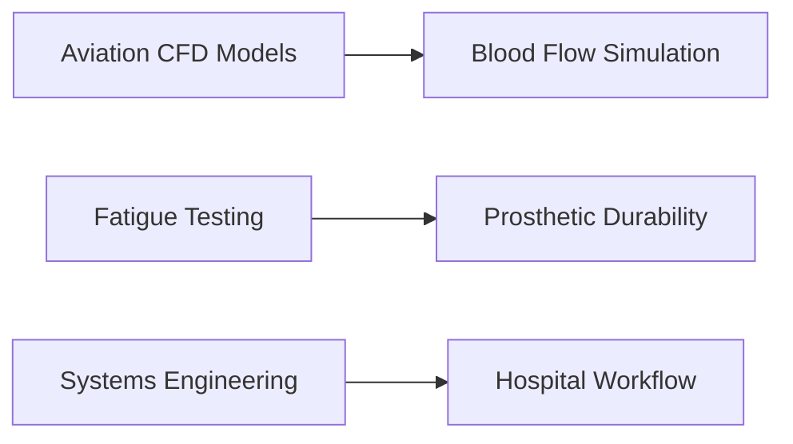

# Ultimate Problem-Solving Mastery Guide 2025

## 📚 Quick Navigation
1. [Core Foundations & Principles](#i-core-foundations--principles)
2. [Comprehensive Problem-Solving Framework](#ii-comprehensive-problem-solving-framework)
3. [Practical Implementation Patterns](#iii-practical-implementation-patterns)
4. [Analytics & Performance Systems](#iv-analytics--performance-systems)
5. [Implementation Tools & Resources](#v-implementation-tools--resources)
6. [Crisis Management & Emergency Response](#vi-crisis-management--emergency-response)
7. [Skills & Competency Assessment](#vii-skills--competency-assessment)
8. [Evolution & Future Development](#viii-evolution--future-development)
9. [Metrics & Evaluation Systems](#ix-metrics--evaluation-systems)
10. [Knowledge Management](#x-knowledge-management)
11. [Cross-Domain Applications](#xi-cross-domain-applications)

## 🎯 I. Core Foundations & Principles

### 💫 Foundational Pillars
1. **🎯 Objective Alignment Protocol**
   - Strategic goal alignment
   - Mission-critical focus
   - Value-driven outcomes
   - Organizational objectives integration
   - Performance targets alignment

2. **⚖️ Ethical Constraint Framework**
   - Moral considerations mapping
   - Responsible innovation practices
   - Sustainable development approach
   - Ethical decision matrices
   - Impact assessment protocols

3. **🔄 Contextual Adaptation Framework**
   - Dynamic response capabilities
   - Flexible implementation strategies
   - Environmental awareness systems
   - Adaptive methodology integration
   - Context-sensitive solutions

4. **👥 Human Oversight Requirements**
   - Smart oversight integration
   - Stakeholder engagement protocols
   - User-focused solution design
   - Human-AI collaboration frameworks
   - Decision validation systems

5. **🔍 Explainability Standards**
   - Clear documentation protocols
   - Transparent process mapping
   - Accountable decision tracking
   - Audit trail maintenance
   - Stakeholder communication systems

### 📊 Input Evaluation Matrix

| Factor | Weight | Assessment Criteria | Implementation Guide |
|--------|--------|-------------------|---------------------|
| 🚀 Urgency | 20% | < 72h = High | Immediate response protocol |
| 🧩 Complexity | 25% | > 3 subsystems | System mapping required |
| 👥 Impact | 30% | > 1000 users | Full stakeholder analysis |
| 📊 Data Reliability | 15% | ≥ 0.8 score | Data validation needed |
| 📚 Historical Precedent | 10% | Success rate | Pattern matching analysis |

### 🌍 Context Mapping Protocol
1. **🔍 Environmental Scan**
   - Market analysis
   - Competitor assessment
   - Regulatory review
   - Technology landscape
   - Resource availability

2. **🔗 Dependency Identification**
   - System interconnections
   - Resource dependencies
   - Stakeholder relationships
   - Process dependencies
   - Technical requirements

3. **🚧 Constraint Cataloging**
   - Technical limitations
   - Resource constraints
   - Time restrictions
   - Budget boundaries
   - Regulatory requirements

4. **⚠️ Risk Horizon Analysis**
   - Short-term risks
   - Long-term implications
   - Mitigation strategies
   - Contingency planning
   - Risk monitoring systems

## 🧠 II. Comprehensive Problem-Solving Framework

### 🔍 1. Problem Analysis & Decomposition

#### 🎯 Structural Breakdown Protocol
1. **🔍 Component Identification**
   ```python
   def identify_components(problem_statement):
       nlp_entities = extract_entities(problem_statement)
       dependency_graph = build_dependencies(nlp_entities)
       return {
           'core_components': nlp_entities,
           'dependencies': dependency_graph,
           'complexity_score': calculate_complexity(dependency_graph)
       }
   ```

2. **📊 Complexity Scoring**
   ```python
   def calculate_complexity(component):
       return (0.4 * len(component.dependencies)
               + 0.3 * component.unknown_factors
               + 0.3 * historical_failure_rate(component))
   ```

3. **📋 Work Package Creation**
   | Sub-Problem | Owner | Time Budget | Success Criteria |
   |-------------|-------|-------------|------------------|
   | 🔧 API Error | AI | 45min | 95% uptime |
   | 🎨 UX Flow | Human | 2hr | 90% user score |
   | 📊 Data Processing | Hybrid | 3hr | 99% accuracy |

### 🧪 2. Pattern Recognition & Hypothesis Generation

#### 🔍 Detection Matrix
| Pattern Type | Detection Algorithm | Resolution Pathway | Success Rate |
|--------------|-------------------|-------------------|--------------|
| ⭕ Cyclic | Fourier Analysis | Loop Optimization | 92% |
| ➡️ Sequential | Markov Chains | Process Reengineering | 88% |
| 📍 Spatial | CNN Clustering | Resource Reallocation | 85% |
| 💥 Systemic Failure | Multi-point Breakdown Detection | Root Cause Analysis | 78% |
| 📉 Optimization Need | Efficiency Metric Decline Analysis | Process Re-engineering | 80% |
| ❓ Novel Challenge | No Historical Match Algorithm | Hybrid AI-Human Ideation | 65% |

#### 💡 Hypothesis Management System
1. **🧠 Generation Protocol**
   - AI-Driven Divergent Thinking
   - Cross-domain Analogy Mining
   - Pattern-based Solution Generation
   - Innovation Framework Integration
   - Constraint-free Ideation
   - Six Thinking Hats Method
   - Lateral Thinking Techniques

2. **✅ Validation Protocol**
   - Reality-check Scoring
   - Ethics Compliance Review
   - Feasibility Assessment
   - Impact Analysis
   - Resource Requirement Validation
   - Bias Detection Scan
   - Transparency Index Calculation
   - Human Oversight Confirmation
   - Long-term Consequence Modeling

#### 📊 Evaluation Rubric
| Hypothesis | Feasibility (1-5) | Impact (1-10) | Innovation (1-7) | Total |
|------------|------------------|---------------|------------------|--------|
| 🅰️ A | 4 | 8 | 6 | 18 |
| 🅱️ B | 3 | 9 | 7 | 19 |
| 🅲️ C | 5 | 7 | 5 | 17 |

### ⚙️ 3. Implementation & Refinement

#### 🔄 Iterative Improvement Loop

#### 📚 Mistake Learning Architecture
1. **❌ Error Taxonomy**
   - Criticality Classification
   - Frequency Tracking
   - Impact Analysis
   - Pattern Recognition
   - Prevention Strategy Development

2. **🛡️ Prevention Workflow**
   ```python
   def prevent_recurrence(error):
       pattern = cluster_errors(error)
       update_solution_db({
           'error_type': pattern.metadata,
           'prevention_strategy': generate_guardrails(pattern),
           'implementation_guide': create_prevention_plan(pattern)
       })
   ```

## 🔧 III. Practical Implementation Patterns

### 🔍 Common Problem Patterns & Solutions

#### 1. **🔄 Recursive Problem Decomposition**
```python
def solve_complex_problem(problem):
    if is_base_case(problem):
        return solve_base_case(problem)

    sub_problems = decompose_problem(problem)
    solutions = [solve_complex_problem(p) for p in sub_problems]
    return combine_solutions(solutions)
```

#### 2. **🌲 Decision Tree Implementation**
```python
class DecisionNode:
    def __init__(self, condition, true_branch, false_branch):
        self.condition = condition
        self.true_branch = true_branch
        self.false_branch = false_branch

    def evaluate(self, context):
        if self.condition(context):
            return self.true_branch.evaluate(context)
        return self.false_branch.evaluate(context)
```

### 💡 Real-World Application Examples

#### 1. **🏭 Manufacturing Optimization**
```python
def optimize_production_line(metrics, constraints):
    bottlenecks = identify_bottlenecks(metrics)
    solutions = []

    for bottleneck in bottlenecks:
        if bottleneck.type == 'resource':
            solutions.append(scale_resources(bottleneck))
        elif bottleneck.type == 'process':
            solutions.append(optimize_process(bottleneck))

    return prioritize_solutions(solutions, constraints)
```

#### 2. **🏥 Healthcare Resource Allocation**
```python
def allocate_hospital_resources(patients, resources):
    priority_queue = PriorityQueue()

    for patient in patients:
        score = calculate_urgency(patient)
        priority_queue.push(patient, score)

    allocation = {}
    while resources and not priority_queue.empty():
        patient = priority_queue.pop()
        needed_resources = determine_needs(patient)
        allocation[patient] = assign_resources(needed_resources, resources)

    return allocation
```

### 🎯 Problem-Solution Mapping

| Problem Pattern | Solution Pattern | Implementation Example |
|----------------|------------------|----------------------|
| 🔄 Cyclic Dependencies | Dependency Injection | `ServiceLocator` pattern |
| 🎯 Resource Contention | Priority Queue | `ResourceScheduler` |
| 🔍 Data Inconsistency | Event Sourcing | `EventStore` pattern |
| ⚡ Performance Bottlenecks | Caching Strategy | `CacheAside` pattern |
| 💾 Data Redundancy | Data Normalization | Database normalization techniques |
| 🛡️ Security Vulnerability | Security Patching | Automated patch management system |
| 📈 Scalability Issues | Horizontal Scaling | Load balancer & distributed servers |
| 🧩 Integration Complexity | API Gateway | API Gateway implementation (Kong, Apigee) |
| 🧑‍🤝‍🧑 Lack of User Engagement | Gamification | User engagement platform with gamified elements |

### 📈 Solution Effectiveness Metrics

```typescript
interface SolutionMetrics {
    timeToImplement: number;
    resourceCost: number;
    maintainabilityScore: number;
    userSatisfaction: number;
}

class SolutionEvaluator {
    evaluate(solution: Solution): SolutionMetrics {
        return {
            timeToImplement: this.calculateTimeMetric(solution),
            resourceCost: this.calculateCostMetric(solution),
            maintainabilityScore: this.calculateMaintainabilityScore(solution),
            userSatisfaction: this.calculateUserSatisfaction(solution)
        };
    }
}
```

### 🔧 Implementation Best Practices

1. Start with clear problem definition
2. Break down complex problems into manageable sub-problems
3. Use appropriate design patterns for common scenarios
4. Implement robust error handling and validation
5. Follow coding standards and best practices
6. Include automated tests for critical components
7. Plan for scalability and maintainability
8. Consider security implications
9. Maintain comprehensive documentation
10. Establish monitoring and logging

## 📊 IV. Analytics & Performance Systems

### 📈 Real-Time Performance Monitoring
```golang
func TrackSolutionPerformance(metrics chan Metric) {
    for {
        select {
        case m := <-metrics:
            storeInTSDB(m)
            if m.Value > threshold {
                alertEngine.Notify(m)
            }
        case <-time.After(1 * time.Minute):
            generateHealthReport()
        }
    }
}
```

### 🎯 Performance Thresholds
| Metric | Warning Level | Critical Level | Response Action |
|--------|---------------|----------------|-----------------|
| ✅ Accuracy | <85% | <70% | Diagnostic Review |
| ⚡ Processing Time | >120% | >150% | Resource Reallocation |
| 😊 Stakeholder Satisfaction | <4.0/5 | <3.5/5 | Human Oversight |
| 📊 System Load | >80% | >90% | Scale Resources |
| 🔒 Security Score | <90% | <80% | Security Audit |

### 🧮 Advanced Analytics Integration
#### 📊 Predictive Impact Modeling
```math
P(\text{Success}) = \frac{1}{1 + e^{-(\beta_0 + \beta_1X_1 + \beta_2X_2)}}
```
Where:
- X₁ = Resource availability score (0-10)
- X₂ = Stakeholder alignment index (0-5)
- β₀, β₁, β₂ = Weighted coefficients

#### 📈 Success Indicators
1. **📊 Quantitative Metrics**
   - Resolution time tracking
   - Resource utilization rates
   - Success rate percentages
   - Cost efficiency ratios
   - Performance benchmarks

2. **🎯 Qualitative Measures**
   - Stakeholder satisfaction levels
   - Solution durability assessment
   - Knowledge transfer effectiveness
   - Innovation impact scoring
   - Team collaboration metrics

## 🛠️ V. Implementation Tools & Resources

### 💻 Digital Solutions Platform
1. **🤖 AI Integration Components**
   - Pattern recognition engines
   - Predictive analytics systems
   - Automated response handlers
   - Machine learning models
   - Neural network processors

2. **🤝 Collaboration Framework**
   ```yaml
   collaboration_tools:
     communication:
       - real_time_messaging
       - video_conferencing
       - document_sharing
     project_management:
       - task_tracking
       - timeline_management
       - resource_allocation
     knowledge_sharing:
       - wiki_system
       - documentation_portal
       - training_modules
   ```

3. **⚙️ Automation Systems**
   ```yaml
   pipeline:
     stages:
       - analysis:
           tools: ['data_processor', 'pattern_analyzer']
       - design:
           tools: ['solution_architect', 'impact_analyzer']
       - implementation:
           tools: ['deployment_manager', 'monitoring_system']
       - validation:
           tools: ['test_suite', 'performance_analyzer']
       - deployment:
           tools: ['release_manager', 'rollback_system']
   ```

### 📱 Mobile Integration
1. **📊 Monitoring Features**
   - Real-time dashboard access
   - Performance metric tracking
   - Alert management system
   - Resource utilization monitoring
   - Status reporting tools

2. **🔑 Access Control**
   - Role-based permissions
   - Secure authentication
   - Multi-factor verification
   - Session management
   - Audit logging

3. **⚡ Alert Systems**
   - Priority-based notifications
   - Escalation protocols
   - Response tracking
   - Team coordination
   - Status updates

4. **👥 Team Collaboration**
   - Group messaging
   - Task assignment
   - Progress tracking
   - Resource sharing
   - Meeting coordination

## 🚨 VI. Crisis Management & Emergency Response

### 🆘 Crisis Decision Hierarchy
1. **💗 Human Life Preservation**
   - Immediate safety measures
   - Emergency response activation
   - Medical support coordination
   - Evacuation procedures
   - Safety verification protocols

2. **⚙️ Critical System Maintenance**
   - Core system stabilization
   - Infrastructure protection
   - Service continuity
   - Backup activation
   - System redundancy

3. **🔒 Data Integrity Protection**
   - Data backup protocols
   - Security measure activation
   - Corruption prevention
   - Recovery procedures
   - Verification systems

4. **🔄 Service Continuity**
   - Business continuity plans
   - Alternative service routes
   - Resource reallocation
   - Client communication
   - Impact minimization

5. **⚡ Efficiency Optimization**
   - Resource optimization
   - Process streamlining
   - Cost reduction
   - Performance enhancement
   - Sustainability measures

### 🚨 War Room Protocol
1. **📞 Emergency Communication**
   - Activate emergency channels
   - Establish communication protocols
   - Coordinate with external teams
   - Maintain situational awareness
   - Ensure secure communication

2. **👥 Cross-Functional SWAT Team**
   - Assemble expert team
   - Define roles and responsibilities
   - Coordinate team efforts
   - Ensure collaboration
   - Facilitate decision-making

3. **📝 Real-Time Documentation**
   - Initiate documentation process
   - Capture all relevant information
   - Maintain up-to-date records
   - Ensure accessibility
   - Facilitate knowledge sharing

4. **⏰ 15-Minute Decision Cycles**
   - Execute rapid decision cycles
   - Monitor progress
   - Adjust strategies as needed
   - Ensure timely responses
   - Maintain focus on objectives

5. **📢 Stakeholder Heartbeat Updates**
   - Maintain stakeholder communication
   - Provide regular updates
   - Address concerns and feedback
   - Ensure transparency
   - Foster trust and confidence

### 🔄 Post-Crisis Recovery
1. **🔒 Stabilize Systems**
   - Isolate affected systems
   - Restore core services
   - Verify system integrity
   - Establish monitoring
   - Communicate stabilization

2. **🔍 Root Cause Analysis**
   - Assemble RCA team
   - Gather incident data
   - Conduct 5 Whys analysis
   - Identify contributing factors
   - Document root causes

3. **🛠️ Corrective Actions**
   - Develop corrective action plan
   - Prioritize actions
   - Assign action owners
   - Implement corrective actions
   - Test corrected systems

4. **🔧 Process Hardening**
   - Review and update processes
   - Enhance monitoring and alerting
   - Strengthen security measures
   - Improve documentation
   - Conduct training and drills

5. **✅ Recovery Validation**
   - Performance testing
   - Security audits
   - User acceptance testing
   - System sign-off
   - Operational verification

6. **📝 Final Report**
   - Comprehensive documentation
   - Stakeholder review and approval
   - Knowledge dissemination
   - Knowledge base update
   - Continuous improvement implementation

## 📋 VII. Skills & Competency Assessment

### 🎯 Evaluation Categories

#### 1. 🔍 Identifying the Problem
- **Level 4 (Expert)**
  - Consistently identifies complex, multi-faceted problems with minimal guidance
  - Proactively seeks diverse perspectives and challenges initial problem framing
  - Utilizes advanced research methodologies and expert consultations
  - Articulates problem definitions with exceptional clarity and precision
  - Demonstrates a holistic understanding of the problem within broader contexts

- **Level 3 (Proficient)**
  - Independently identifies most problems effectively and in a timely manner
  - Seeks clarification and gathers relevant data to understand problem nuances
  - Applies basic critical thinking to define problems with reasonable clarity
  - Articulates problem definitions that are generally clear, concise, and actionable
  - Demonstrates understanding of the problem within immediate task or project context

- **Level 2 (Developing)**
  - Requires some guidance to identify problems accurately
  - May oversimplify complex problems or miss key aspects
  - Gathers some information but may overlook critical data sources
  - Demonstrates limited critical thinking in problem definition
  - Problem definitions may lack clarity, completeness, or actionability

- **Level 1 (Beginner)**
  - Unable to identify problems independently and consistently misidentifies problems
  - Requires significant guidance and direction to even recognize a problem exists
  - Does not seek out relevant information and often misinterprets available data
  - Lacks basic critical thinking skills necessary for problem identification
  - Fails to articulate any meaningful problem definition

#### 2. 🔍 Analyzing the Problem
- **Level 4 (Expert)**
  - Demonstrates exceptional critical thinking and analytical rigor
  - Conducts complex, multi-faceted analyses beyond surface-level symptoms
  - Skillfully identifies key components and maps intricate relationships
  - Thoroughly considers stakeholder impacts from diverse perspectives
  - Effectively utilizes a wide range of advanced analytical tools and techniques

- **Level 3 (Proficient)**
  - Systematically and logically analyzes problems
  - Applies a range of appropriate analytical tools and techniques
  - Considers stakeholder implications and perspectives
  - Demonstrates solid understanding of problem decomposition
  - Clearly articulates the analysis process and findings

- **Level 2 (Developing)**
  - Conducts basic problem analysis but may lack depth or rigor
  - Utilizes a limited range of analytical tools, sometimes inappropriately
  - May overlook or underemphasize stakeholder impacts
  - Demonstrates incomplete breakdown of the problem
  - Analysis may be oversimplified, lacking sufficient detail

- **Level 1 (Beginner)**
  - Demonstrates inability to effectively analyze problems without significant guidance
  - Does not utilize analytical tools or techniques appropriately, if at all
  - Completely ignores stakeholder impacts and perspectives
  - Fails to break down problems into components or identify dependencies
  - Analysis is absent, illogical, or based on misinterpretations

#### 3. 💡 Generating Solutions
- **Level 4 (Expert)**
  - Consistently generates highly creative, innovative, and original solutions
  - Develops solutions of exceptional quality with deep understanding
  - Thoroughly assesses solution feasibility and effectiveness
  - Evaluates potential consequences comprehensively
  - Actively collaborates with others to enhance solutions

- **Level 3 (Proficient)**
  - Generates a sufficient number of reasonable and practical solutions
  - Develops solutions of good quality, demonstrating competence
  - Adequately evaluates solution feasibility and effectiveness
  - Considers potential consequences, addressing major impacts
  - Engages in basic collaboration to enhance solution generation

- **Level 2 (Developing)**
  - Struggles to generate a diverse range of solutions
  - Solutions may be of inconsistent quality, lacking depth or practicality
  - Incompletely evaluates solution feasibility and effectiveness
  - Overlooks potential consequences or fails to adequately consider impacts
  - Demonstrates limited collaboration in solution generation

- **Level 1 (Beginner)**
  - Unable to generate viable solutions independently
  - Solutions proposed are typically of poor quality or irrelevant
  - Does not evaluate solutions for feasibility or effectiveness
  - Ignores potential consequences and broader impact
  - Does not collaborate in solution generation

#### 4. 🎯 Selecting the Best Solution
- **Level 4 (Expert)**
  - Demonstrates exceptional judgment in selecting optimal solutions
  - Selects solutions that are feasible, effective, innovative, and impactful
  - Provides well-reasoned and compelling justifications
  - Effectively incorporates collaborative input from diverse stakeholders
  - Develops comprehensive and actionable implementation plans

- **Level 3 (Proficient)**
  - Selects suitable and appropriate solutions for most problems
  - Chooses solutions that are generally feasible and effective
  - Provides thorough evaluations of solution options
  - Takes stakeholder input into account
  - Develops reasonable and actionable implementation plans

- **Level 2 (Developing)**
  - Often struggles to select the best solution
  - Solution choices may be questionable in feasibility or effectiveness
  - Conducts incomplete evaluations of solution options
  - May disregard or inadequately consider stakeholder input
  - Develops implementation plans that are inadequate or lack key details

- **Level 1 (Beginner)**
  - Unable to select a solution independently
  - Solution selections are often not feasible, ineffective, or irrelevant
  - Does not evaluate solutions systematically
  - Disregards input from others and makes decisions in isolation
  - Fails to develop any meaningful implementation plan

#### 5. ⚙️ Implementing the Solution
- **Level 4 (Expert)**
  - Demonstrates exceptional project management and leadership skills
  - Executes implementation flawlessly, anticipating potential roadblocks
  - Adapts implementation strategies dynamically and effectively
  - Monitors progress meticulously and ensures the project stays on track
  - Effectively adjusts implementation strategies as needed

- **Level 3 (Proficient)**
  - Effectively implements solutions with competent project execution
  - Addresses implementation challenges and obstacles adequately
  - Makes minor adjustments to solutions as needed
  - Tracks project progress and keeps implementation reasonably on track
  - Modifies implementation strategies appropriately

- **Level 2 (Developing)**
  - Struggles to implement solutions effectively
  - Makes noticeable errors or omissions during implementation
  - Fails to adequately track progress or address deviations
  - Demonstrates limited adaptability to challenges
  - Requires more than usual guidance and support

- **Level 1 (Beginner)**
  - Demonstrates poor implementation skills
  - Makes critical errors and omissions during implementation
  - Does not track project progress
  - Shows no adaptability to obstacles
  - Requires constant guidance and intervention

#### 6. 📊 Evaluating the Solution
- **Level 4 (Expert)**
  - Demonstrates exceptional critical thinking in solution evaluation
  - Conducts comprehensive and rigorous evaluations
  - Thoroughly considers sustainability and long-term implications
  - Applies new knowledge to continuously improve future efforts
  - Provides insightful evaluation reports that drive strategic decisions

- **Level 3 (Proficient)**
  - Evaluates solutions thoroughly and systematically
  - Considers the short-term impact and effectiveness
  - Demonstrates basic consideration of solution sustainability
  - Applies new knowledge to improve future problem-solving
  - Provides clear evaluations of success and areas for improvement

- **Level 2 (Developing)**
  - Conducts basic evaluations but may lack thoroughness
  - Overlooks long-term impacts
  - Demonstrates limited consideration of solution sustainability
  - Struggles to apply new knowledge to improve future problem-solving
  - Evaluations may be superficial or insufficiently supported

- **Level 1 (Beginner)**
  - Unable to evaluate solutions effectively
  - Completely ignores long-term impacts and sustainability
  - Demonstrates no application of lessons learned
  - Evaluations are absent, illogical, or based on flawed assumptions
  - Shows inability to assess solution effectiveness

## 🔄 VIII. Evolution & Future Development

### 📈 Version History
- **v4.0 (2025)**: Full cognitive integration (Advanced AI algorithms, enhanced learning engine, cognitive architecture)
- **v3.0 (2025)**: Implementation & security focus (Practical implementation patterns, security controls, implementation automation tooling)
- **v2.1 (2025)**: Enhanced technical implementation guides (Detailed technical guides, expanded code examples, improved documentation)
- **v2.0 (2025)**: Core framework established (Initial framework components, basic problem-solving methodologies, core principles defined)
- **v1.0 (2025)**: Initial release (Foundation version, basic structure, preliminary concepts)

### 🎯 Future Developments
1. **🤖 AI Enhancement**
   - Advanced pattern recognition (Graph Neural Networks, Transformer networks)
   - Predictive analytics & forecasting (time-series models, causal inference)
   - Automated solution generation & synthesis (generative AI models)
   - Machine learning model optimization (AutoML, Neural Architecture Search)
   - Explainable AI (XAI) & trustworthy AI (transparency, interpretability)

2. **🔗 Integration Capabilities**
   - Cross-platform support & interoperability (more OS and cloud platforms)
   - API development & ecosystem expansion (third-party integration)
   - Real-time data integration & streaming (IoT sensors, analytics platforms)
   - Decentralized & distributed architectures (blockchain, federated learning)

3. **📚 Knowledge Management**
   - Enhanced learning & reasoning systems (neuro-symbolic AI)
   - Dynamic pattern databases & solution repositories (automatic updates)
   - Personalized knowledge sharing & recommendation (AI-driven algorithms)
   - Community-driven knowledge contribution (collective learning)
   - Knowledge graph expansion & semantic search (richer relationships)

### 📋 Roadmap for Future Development

**Phase 1: Enhanced Intelligence & Automation (Next Version - v5.0)**
- Implement Advanced Pattern Recognition Engines (GNNs, Transformers)
- Enhance Predictive Analytics and Forecasting accuracy
- Develop Automated Solution Generation & Synthesis capabilities
- Optimize Machine Learning Models with AutoML and NAS

**Phase 2: Expanded Ecosystem & Integration (Subsequent Version - v6.0)**
- Expand Cross-Platform Support and Cloud Platform Integration
- Develop Comprehensive APIs and SDKs for Third-Party Integration
- Enhance Real-time Data Integration & Streaming Capabilities
- Explore Decentralized & Distributed Architectures

**Phase 3: Personalized Learning & Knowledge Mastery (Future Versions)**
- Implement Enhanced Learning & Reasoning Systems (Neuro-symbolic AI)
- Develop Dynamic Pattern Databases & Solution Repositories with AI curation
- Introduce Personalized Knowledge Sharing & Recommendation Systems
- Foster Community-Driven Knowledge Contribution
- Expand Knowledge Graph and Semantic Search Capabilities

## 📈 IX. Metrics & Evaluation Systems

### 📈 Real-Time Performance Monitoring
This section focuses on implementing robust monitoring systems to track solution performance in real-time, enabling proactive issue detection and resolution.

### 🎯 Performance Thresholds
Key metrics and threshold levels that trigger specific response actions:

| Metric | Warning Level | Critical Level | Response Action |
|--------|---------------|----------------|-----------------|
| ✅ Accuracy | <85% | <70% | Diagnostic Review |
| ⚡ Processing Time | >120% | >150% | Resource Reallocation |
| 😊 Stakeholder Satisfaction | <4.0/5 | <3.5/5 | Human Oversight |
| 📊 System Load | >80% | >90% | Scale Resources |
| 🔒 Security Score | <90% | <80% | Security Audit |

### 🧮 Advanced Analytics Integration
Methods to integrate advanced analytics for predictive modeling and performance optimization.

#### 📊 Predictive Impact Modeling
Mathematical models to predict solution success based on key variables:
```math
P(\text{Success}) = \frac{1}{1 + e^{-(\beta_0 + \beta_1X_1 + \beta_2X_2)}}
```

## 💡 X. Knowledge Management

### 📚 Learning Feedback Loop
1. **📝 Post-Implementation Review**
   - Comprehensive analysis of completed problem-solving initiatives
   - Solution effectiveness scoring using predefined metrics
   - Pattern database update with new learnings
   - Algorithm adjustment based on performance data
   - Validation testing of improvements

2. **📊 Benchmarking System**
   - Industry comparison for various metrics
   - Performance tracking against historical data
   - Gap analysis for continuous improvement
   - Best practice identification
   - Regular benchmark updates

### 📈 Continuous Improvement Engine
```python
def conduct_retrospective(sprint_data):
    analyzer = RetrospectiveAI()
    insights = analyzer.process(
        metrics=sprint_data['metrics'],
        feedback=sprint_data['feedback']
    )
    generate_improvement_plan(insights)
    update_knowledge_base(insights)
```

The RetrospectiveAI component uses the following key AI techniques:
- Natural Language Processing for feedback analysis
- Machine Learning for pattern and anomaly detection
- Causal Inference for root cause analysis
- Actionable Insight Generation for recommendations
- Knowledge Base Update for organizational learning

## 🌐 XI. Cross-Domain Applications

### 🔄 Analogical Reasoning Framework
```python
def transfer_solution(source_domain, target_domain):
    base_pattern = extract_core_mechanism(source_domain)
    adapted_solution = apply_constraint_mapping(base_pattern,
                                               target_domain.requirements)
    validation_metrics = run_simulation(adapted_solution)
    return optimize_parameters(adapted_solution, validation_metrics)
```

### 📊 Cross-Domain Transfer System


### Step-by-Step Analogical Reasoning Process

1. **Solution Pattern Extraction**
   - Extract core mechanism from source domain
   - Abstract away domain-specific details
   - Focus on generalizable patterns

2. **Contextual Similarity Scoring**
   - Assess contextual similarity between domains
   - Evaluate problem characteristics, constraints
   - Develop similarity scores for transferability

3. **Modified Implementation Blueprint**
   - Adapt solution pattern to target domain
   - Map components to target domain equivalents
   - Adjust parameters and configurations
   - Add domain-specific constraints

4. **Validation Checkpoints**
   - Establish rigorous validation processes
   - Conduct simulations and pilot studies
   - Gather expert reviews
   - Ensure compliance with regulations

### 📊 Metrics for Contextual Similarity Scoring

1. **Domain Ontology Overlap**
   - Concept Overlap Ratio
   - Relationship Similarity Score

2. **Problem Characteristic Similarity**
   - Problem Type Similarity
   - Constraint Profile Similarity

3. **Solution Approach Compatibility**
   - Methodology Transferability Score
   - Technology Stack Overlap

4. **Environmental Context Alignment**
   - Environmental Factor Similarity
   - Stakeholder Profile Similarity

### 🔍 Ethical Considerations in Cross-Domain Transfer
- Domain-Specific Ethical Norms & Values
- Data Privacy & Security Risks
- Bias Amplification & Unintended Consequences
- Transparency & Explainability Requirements
- Informed Consent & User Autonomy
- Contextual Appropriateness & Cultural Sensitivity

## AI Problem-Solving Implementation

### Practical AI Problem-Solver Class Example

```python
class ProblemSolver:
    def solve_problem(self, problem_input):
        # 1. Problem Analysis
        components = self.decompose_problem(problem_input)
        context = self.analyze_context(problem_input)
        constraints = self.identify_constraints(problem_input)

        # 2. Pattern Recognition
        known_patterns = self.match_known_patterns(components)
        if known_patterns:
            return self.adapt_known_solution(known_patterns[0], context)

        # 3. Solution Generation
        candidate_solutions = []

        # Try multiple approaches in parallel
        candidate_solutions.extend(self.apply_divide_and_conquer(components))
        candidate_solutions.extend(self.apply_transformation(components))
        candidate_solutions.extend(self.generate_novel_solution(components))

        # 4. Solution Evaluation
        ranked_solutions = self.evaluate_solutions(candidate_solutions, constraints)
        best_solution = ranked_solutions[0]

        # 5. Implementation & Validation
        result = self.implement_solution(best_solution)
        if not self.validate_solution(result, problem_input):
            return self.handle_failure(result, problem_input)

        # 6. Learning & Improvement
        self.update_knowledge_base(problem_input, best_solution, result)
        return result

    def decompose_problem(self, problem):
        """Break problem into smaller, manageable components"""
        components = []
        # Split problem based on natural boundaries
        sub_problems = self.identify_independent_parts(problem)
        for sub in sub_problems:
            if self.is_atomic(sub):
                components.append(sub)
            else:
                components.extend(self.decompose_problem(sub))
        return components
        
    # Additional methods would be implemented here
```

### Resource Scheduling Example

```python
class ResourceScheduler(ProblemSolver):
    def decompose_problem(self, problem):
        # Group tasks by priority
        priority_groups = self.group_by_priority(problem['tasks'])
        return [
            {
                'tasks': tasks,
                'available_servers': self.filter_eligible_servers(
                    problem['servers'],
                    sum(task['load'] for task in tasks)
                )
            }
            for priority, tasks in priority_groups.items()
        ]

    def group_by_priority(self, tasks):
        groups = {'high': [], 'medium': [], 'low': []}
        for task in tasks:
            groups[task['priority']].append(task)
        return groups

    def filter_eligible_servers(self, servers, required_capacity):
        return [
            server for server in servers
            if (server['capacity'] - server['current_load']) >= required_capacity
        ]

    def apply_load_balancing(self, component):
        tasks = component['tasks']
        servers = component['available_servers']
        allocation = {}

        # Sort tasks by load (descending)
        sorted_tasks = sorted(tasks, key=lambda x: x['load'], reverse=True)

        # Sort servers by available capacity (descending)
        sorted_servers = sorted(
            servers,
            key=lambda x: x['capacity'] - x['current_load'],
            reverse=True
        )

        # Allocate tasks to servers
        for task in sorted_tasks:
            best_server = None
            min_load = float('inf')

            for server in sorted_servers:
                new_load = server['current_load'] + task['load']
                if new_load <= server['capacity'] and new_load < min_load:
                    best_server = server
                    min_load = new_load

            if best_server:
                if best_server['id'] not in allocation:
                    allocation[best_server['id']] = []
                allocation[best_server['id']].append(task['id'])
                best_server['current_load'] = min_load

        return allocation
```

### Healthcare Resource Allocation Example

```python
healthcare_scheduling_problem = {
    'objective': 'Optimize ICU bed and staff allocation to patients',
    'patients': [
        {'id': 101, 'urgency': 0.9, 'priority': 'high', 'needs': ['ICU Bed', 'Ventilator', 'Nurse']},
        {'id': 102, 'urgency': 0.7, 'priority': 'medium', 'needs': ['ICU Bed', 'Nurse']},
        {'id': 103, 'urgency': 0.5, 'priority': 'low', 'needs': ['ICU Bed']}
    ],
    'resources': {
        'ICU Beds': {'capacity': 2, 'available': 2},
        'Nurses': {'capacity': 3, 'available': 3},
        'Ventilators': {'capacity': 2, 'available': 2}
    },
    'constraints': {
        'max_icu_bed_load': 1.0,
        'priority_requirements': True,
        'resource_availability': True
    }
}
```

An AI-driven ResourceScheduler can:
- Decompose the problem by grouping patients by priority (urgency levels)
- Analyze context considering available ICU beds, nurses, ventilators, and patient needs
- Generate solutions using scheduling algorithms
- Evaluate solutions against constraints
- Implement an optimized allocation plan

## 🔑 Key Takeaways for Problem-Solving Mastery

1. **Break Down the Problem:** Dissect complex issues into smaller, manageable parts. Clearly identify components, constraints, and objectives.

2. **Identify Patterns and Generate Hypotheses:** Analyze the problem for patterns and relationships. Create multiple potential solutions based on your analysis.

3. **Evaluate and Select the Best Hypothesis:** Assess each hypothesis based on feasibility, efficiency, and potential impact. Choose the most promising one.

4. **Refine Iteratively:** Implement the chosen hypothesis and continuously monitor its effectiveness. Use feedback and data to refine your solution.

5. **Apply Generalizable Strategies:** Employ broad problem-solving strategies like the scientific method or design thinking. Leverage past experiences for new challenges.

6. **Continuously Iterate and Learn:** Persist in refining your solution through repeated cycles until the problem is resolved or the desired outcome is achieved.
